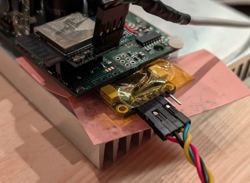
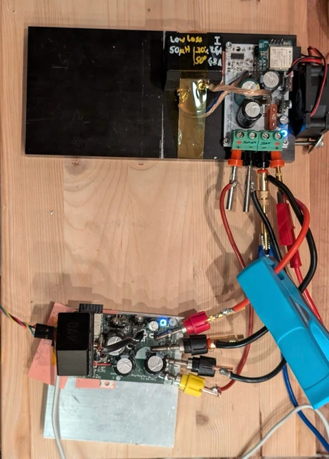
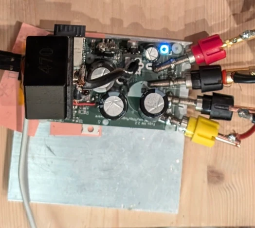

mounted on an 10x10x1.4cm heatsink

# Power Rig Test

* V = 73.7/27
* Iout = 31.5A
* rig supply: 27V, 1.93A
* onboard temp (ntc): 74°C
* coil temp: 100°C
* thermocouple on PCB between caps: 80°C
  * probably heat transfer through wires from coil
* heatsink temp 58°C

put 2sMS184075 coil:
- now 32.8A
- rig supply: 1900mA

