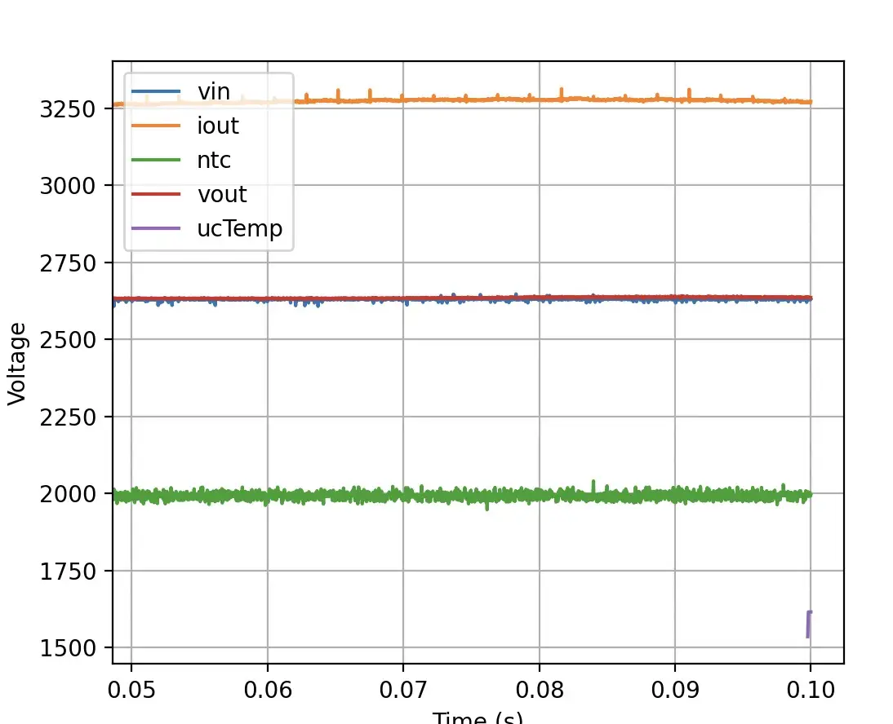
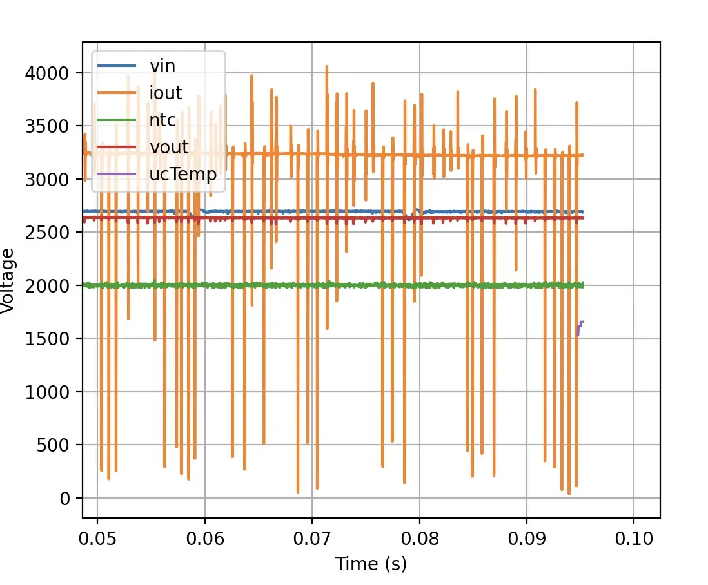

# fheat2

fugu2 board mounted on heat-sink

## heat-sink

- 160 x 83 x 25 AK-EL83-160
- 6.6 °C/W ? ( [heatsinkcalculator](https://www.heatsinkcalculator.com/heat-sink-size-calculator.html) )
- TODO epc calc
-

## Inductor (2s-KS184-125A-d118-s10-n12)

- core: 2s KS184-125A
- coil: w210 cu, 1.18mm (schneitec), 10 strands (used 2m wire per strand)

## Caps:

- Cin: 2p Rubycon ZLH 470µF 100V (33mΩ)
- Cout: Samyoung NXA 470µF 100V (32mΩ)

## MOSFET Switches

- HS: 2p IPP055N08NF2SAKMA1 (Rg+=4.7Ω, Rg-=0)
- LS: IPP022N12NM6AKSA1 Rg=4.7Ω

Measurements:

- Vin= 72V ? , Vout=27V?
- pin=835.81 W, pout=821.10 W, ploss=-1.75%  !!!  (TODO verify, calibrate shunts?)
    - Il=30A ipp=12.2A
- 961.58 W 942.78 W ploss=1.95%
    - I=34.3A, Ipp=13.6A
    -

The fugu-mppt-firmware comes with a scope function, which enables real-time monitoring of ADC samples.
It transmits the samples over UDP and
a [receiver python program](https://github.com/fl4p/fugu-mppt-firmware/blob/main/etc/scope-client/scope-client.py) plots
the data.

Here I found a cheap china inverter causing heavy burst noise (spikes) on the ADC readings.
This is also because of bad wiring: Theres a 1 meter cable between the battery and the inverter, the (+) and the (-)
cable
cover a large area and the MPPT is connected at the inverter terminals.

The inductivity of the 1 meter cables has high impedance for transients, so the MPPT sees all the noise.

A median filter can help here, this lowers the bandwidth of the control loop and thus makes the controller
response slower. Best is to avoid these inverters and mind proper wiring (join loads and chargers at battery terminals like star grounding).

|  |
|:------------------------------------------:|
|       clean signals without inverter       |

|      |
|:----------------------------------------------------:|
| Heavy noise on Iout with cheap china inverter (idle) |

