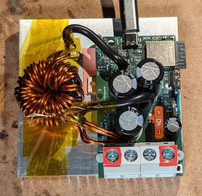
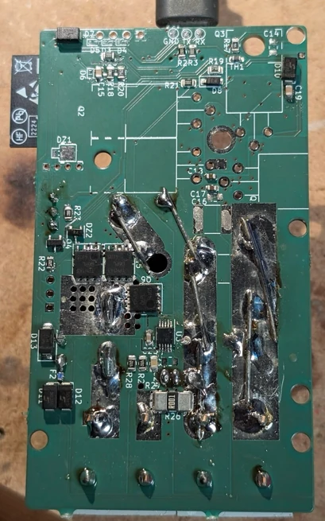
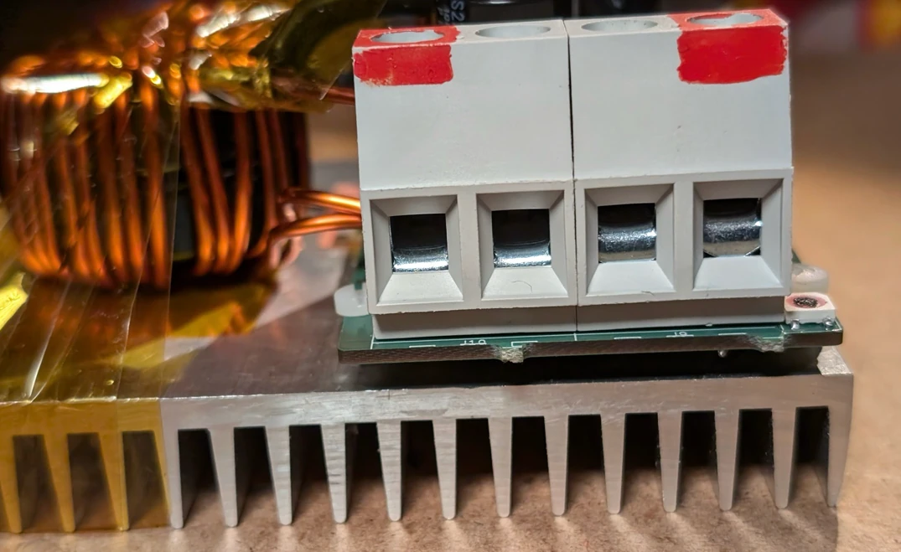
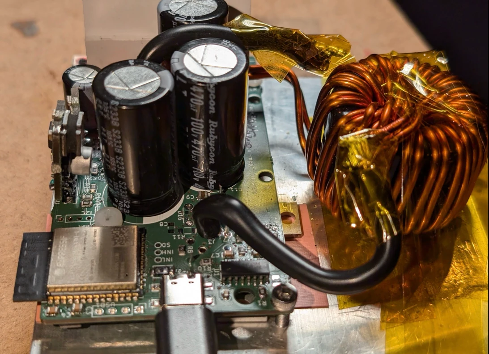

# flat

* first time tried the 3.3V -> 12V boost supply for gate drive voltage
* first build with on-board usb-c

Switches (written on board)
- LS: 1x IPP019N08NF2S
  - 4.7 gate charge
  - no gate dsg (there was an issue with the supply or something, see below)
- HS: 2p CSD

Coil
- Core: 2 staked KS130-060A (Al=122nH/N^2)
- 19~20?Turns => 44~54 uH?

Caps:
- Input: 2p rubycon ZLH 470u 100v
- no 10u ceramic input caps

Heat sink: 100x100x18mm aluminium (~3-5 €)

- ls rise time 262NS
  - FALL 176NS
  - too much?
- when connecting the gate discharge r 2.2, it fails (boot strap supply UV, failure)
- hs r/ftime = 50ns (good)