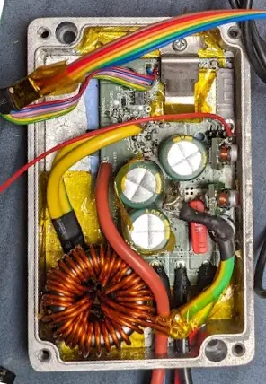
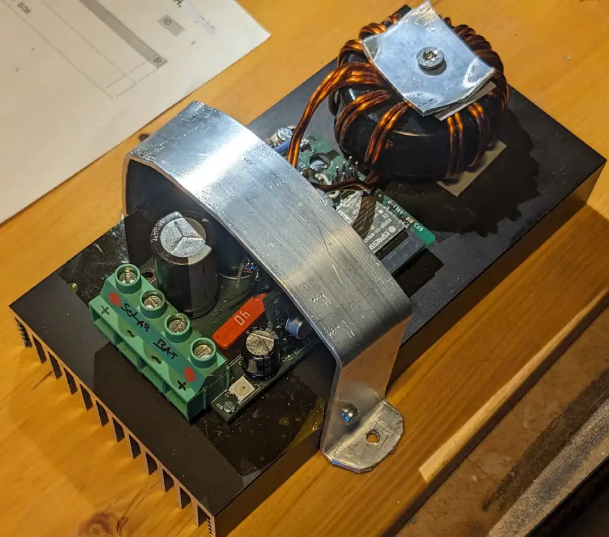
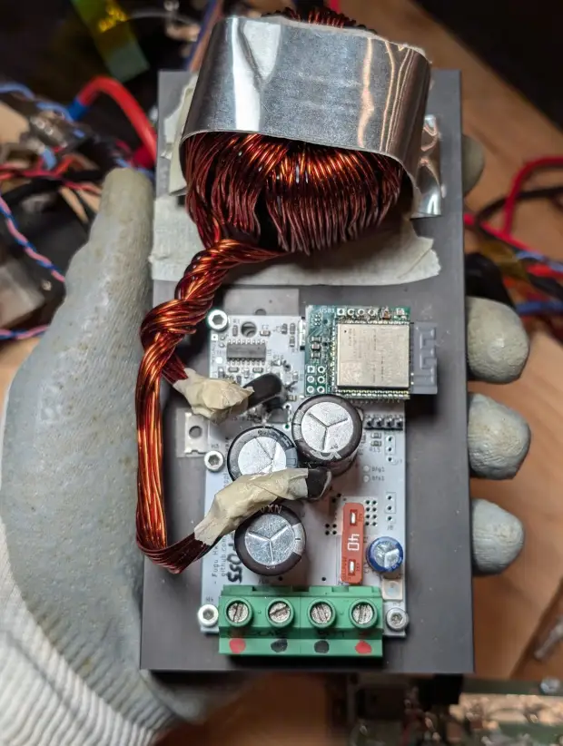
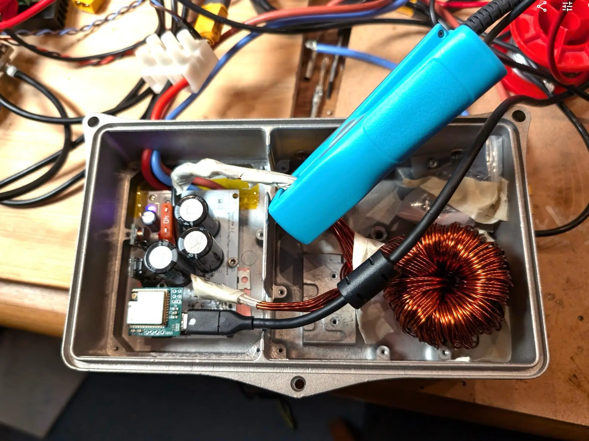
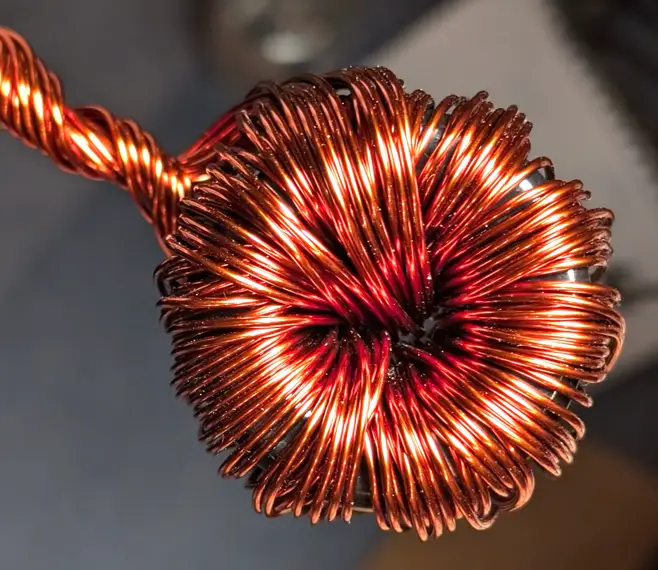
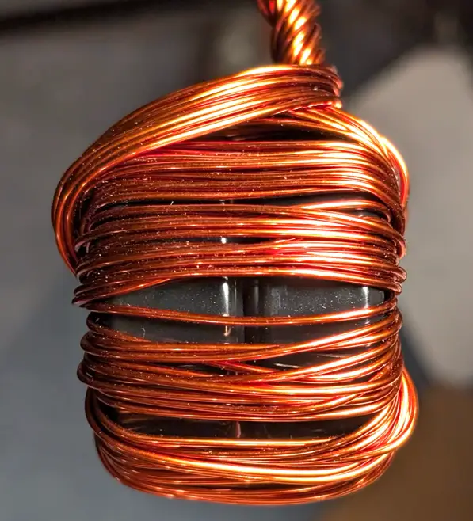

Links: [github](https://github.com/fl4p/Fugu2) | [cadlab](https://cadlab.io/project/28046) | [docs](doc/) | schematics |
IBOM | [firmware](https://github.com/fl4p/fugu-mppt-firmware)
|~ [additional documentation & resources](https://github.com/fl4p/fugu-mppt-doc)

## Gallery

|                                                       |                       |
|:---------------------------------------------------------------------------------------------------:|:---------------------------------------------------------------:|
| Small aluminium enclosure with two T130 sendust cores [fmetal](HW%20Stories/Fugu%20Metal/README.md) | on heatsink, T184 sendust core   [fheat](HW%20Stories/fheat.md) |

|                |  |
|:---------------------------------------------------------:|:-------------------------------------:|
| two T184 sendust cores   [fheat2](HW%20Stories/fheat2.md) |     [fisi](HW%20Stories/fisi.md)      |

## Specs

* Solar input voltage: 12 ~ 80V (higher voltage configurations possible, please create an issue if you need help with
  component selection)
* Battery output voltage: 12 ~ 60V (LiFePo4 4s ~ 16s)
* Max battery current: 32 A
* Efficiency
    * Vin=72 Vout=27 Iout=32A: 98.17% (measured with INA228 & Riedon
      SSA-100, [smart-shunt](https://github.com/open-pe/smart-shunt-fw))

This is inspired by [Fugu MPPT](https://www.instructables.com/DIY-1kW-MPPT-Solar-Charge-Controller/).
The design has been optimized with real life experience, considering signal noise and EMI issues,
replaced hall sensor with shunt resistor and faster switching. See the list below for more changes.

## How to build

* order PCB (or make @home)
    * 1x `Fugu2.kicad_pcb`
    * 2x `psu/buck100.kicad_pcb` (one for 3.3V and one for 12V)
    * 1x `mcu-head/Fugu2-esp32s3-wroom-head.kicad_pcb` (optional. alternatively place the ESP32(-S3) directly on the
      Fugu2 board)
* assemble PCBs
* build inductor
    * order core and copper wire
    * wind the coil
* flash firmware

## Design Principles

* Simplicity with minimum number of components, while keeping EMI and efficiency in mind
* Only 2-layer PCB and using mostly 0805 SMD components, so this can be made at home
* Using TO220 switches for the buck for easy maintenance
* Dense PCB design to reduces parasitic L and R

## Compared to the original design:

- Multiple input caps to increase life-time, efficiency and reduced EMI
- 2 high-side switches in parallel to reduce heat and increase efficiency
- Using ESP32 ADC to sense input voltage, INA226 for bat voltage
- Using current sense resistor with INA226 (immunity against magnetic fields, less drift)
- Current sense on the battery side (less noise, can detect bat reverse current)
- Low-side current sensing because it supports up to 60V battery voltage (for 16s lifepo4 48V batteries)
- Backflow switch on battery side (bat eFuse if sth goes wrong, can safely handle a short of the high-side switches)
- Backflow switch powered by charge pump from the HS gate driver (no extra DC-DC)
- Much higher 4 A gate drive current (previously 130mA and 1.4 A) to reduce switching losses
- Introducing RC snubber circuit to reduce EMI and MOSFET voltage stress
- TVS protection circuit
- off-board 3.3V and 12V power-supply
- USB break-out and off-board programmer (ESP PROG Header)
- Improved voltage and current sense PCB Design (voltage divider & filter caps close to ADC)
- Using LM5163 for power supply. (XL7005A explodes at surge voltages ~80V. Seems vulnerable at temps >~70°C)

## Power loss reduction

* 4A gate driver UCC21330BQDRQ1 with programmable dead-time
    * fast switching (high-side)
    * optimized dead-time, reduce free-wheeling losses (low-side)
* dense half-bridge PCB design for minimum parasitic inductance
* short and min-area gate-drive tracks for minimum gate drive inductance
* low-side rectifier Schottky barrier diode to reduce free-wheeling loss and reverse-recovery loss
* cascade of input capacitors: 220nF, 1uF, 10uF, 470uF input caps to minimize capacitor ESR-loss
    * low impedance electrolytics
* optimized coil designs
    * optimized core flux density and core power loss
    * multi-[strand](https://www.e-magnetica.pl/doku.php/strand) coil for reduced R_dc and R_ac (considering skin &
      proximity effect)

# Inductor Quick Start Guide

The magnetic core material Sendust (KoolMµ) is cheap with good availability and has good saturation characteristics and
low loss.
Manufacturers offer optimized materials, focusing on price, dc bias and core loss.
([KDM](https://semic.cz/!old/files/pdf_www/Ljf_KDM.pdf): KPH, KAM, KAH, KH)

For the coil choose isolated Copper wire made for electrical applictions commonly referred as W210 with typical
conductivity of 58.5 MS/m. Choose diameter and number of strands so that inner diameter of the toroid core has a good
usage.
Prefer multiple strands for easier winding (>2mm diameter becomes unhandy to wind) and reduced ac loss (skin & proximity
effects). Many strands (>10) increase complexity of winding. a diameter between 1 and 2mm appears to be good choice.
More copper reduces dc resistance and leakage fringing (TODO ref).

## 12V or 24V battery up to 40A

* Optimized for low loss 12V and 24V batteries, up to 40A battery current @39kHz
* Core: 2 stacked [KS184-125A](https://www.semic.info/ljf-t184-s-125a-bk/)
* Wire: Ø=1.18mm Cu (1.25mm total), W210 (Grade 2) Copper
* Winding: 10 strands, 12 turns, need 20 meter wire in total (10x 2m)
* Systematic name: 2s-KS184-125A-118cu-10s-12t
* [Micrometals analyzer](https://www.micrometals.com/design-and-applications/design-tools/inductor-analyzer/?name=&inductor_type=D&l=50&iavg=30.37&vin_rms_min=45&vin_rms_max=27&f_switching=39000.0&ambient_temp=40&max_temp_rise=50&temp_rise=1&min_l=40&part_type=A&winding=F&num_cores=2&wire_strands=10&full_ratio=0.9&min_awg=30&pct_win_fill_max_e=100&energy_cost=0.2&continuous_use=0.5&conductor_material=Cu&n=12&strandsxawg=10xAWG%252316.8&partnumber=MS-184125-2&awg=16.8)

## 48V batteries up to 20A

* Core: [KS184-125A](https://www.semic.info/ljf-t184-s-125a-bk/)
* Wire: Ø=1.63mm Cu (AWG14), W210 (Grade 2) Copper
* Winding: 4 strands, 20 turns
* Systematic name: 1s-KS184-125A-163cu-4s-20t
* [Micrometals Analyzer](https://www.micrometals.com/design-and-applications/design-tools/inductor-analyzer/?name=&inductor_type=D&l=60&iavg=15&vin_rms_min=20&vin_rms_max=55&f_switching=39000&ambient_temp=40&max_temp_rise=40&temp_rise=1&min_l=40&part_type=A&winding=F&num_cores=1&wire_strands=4&full_ratio=0.45&min_awg=14&pct_win_fill_max_e=55&energy_cost=0.2&continuous_use=0.5&conductor_material=Cu&n=19&strandsxawg=4xAWG%2314&partnumber=MS-184147-2&awg=14)

# Mosfet Selection

Use [fetlib](https://github.com/fl4p/fetlib) for an extensive parametric search and ranking by power loss estimation.
See [Toshibas Product Guide on pg. 16](https://www.mouser.com/datasheet/2/408/toshiba%20america%20electronic%20components,%20inc._bce008-1209380.pdf#page=16).

## High Side Mosfet (HS, cntrl)

- exposed to switching stress
- short switching times to lower switching losses (small Qsw) but increase potential ringing (EMI)
- low Rds_on
- body diode never conducts
- picks:
    - IPP055N08NF2SAKMA1 (80V 5.5mΩ Qsw=13nC)

## Low Side Switch (LS, sync)

- Choose a mosfet with low Q_rr ([how to compute qrr loss](https://www.ti.com/lit/ta/ssztc00/ssztc00.pdf))
    - Qrr rises with increasing temperature, current and current transient
    - Qrr ringing and loss can be reduced with external Schottky diode
      or [cascode configuration](https://www.researchgate.net/publication/378199983_Improving_the_Reverse-Recovery_Performance_of_Si_SJ-MOSFETs_with_a_Low-Voltage_GaN_HEMT_in_a_Cascode_Configuration).
- low Rds_on
- low Qgd, Qgd/Qgs (prevent self turn-on)
- low r_g (prevent self turn-on)

Current through the LS Switch always flows from source to drain (4th quadrant of V-I plane),
which makes the gate drive signal rather irrelevant. It is much easier to switch than the HS, ringing is generally
not an issue. [TI Gate Drive Fudamentals](https://www.ti.com/lit/ml/slua618a/slua618a.pdf#page=22)
Switching happens near zero voltage, as the body diode is usually already/still conducting when switching on/off.

Choose a MOSFET that is designed for synchronous rectification. Consider switch node ringing and choose a higher voltage
fet to avoid channel break-down if needed.

# Power Conversion Efficiency Optimization

To improve conversion efficiency we first need to understand where power is lost and quantify it.
For quantification we can model power loss or measure it.
There is plenty of literature about modelling power loss in a DC-DC converter.
[fetlib](https://github.com/fl4p/fetlib) can model switch loss, inductor loss and capacitor loss.

Literature: [TI slvaeq9](https://www.ti.com/lit/an/slvaeq9/slvaeq9.pdf) TODO more

The are multiple ways for power loss measurement:

- Measure temperature rise of components using a thermal imager or thermal probe. This will give you can idea where
  most power is lost. If you know the thermal resistance between a component and ambient, you can calculate the power
  loss in
  watts.
- Measure total converter power loss using power two power meters, one at the input and one the output.
- Measure component loss using a multimeter (static i2r loss)
  or [oscilloscope](https://www.tek.com/en/documents/application-note/circuit-measurement-inductors-and-transformers-oscilloscope).
  Needs careful probe calibration and de-skew.

Some points to consider:

* main losses are usually switch loss and inductor loss
* measure coil ripple current. dc core saturation can lead to significant inductance drop and extreme current peaks,
  increasing loss in capacitors and switches.
* Check coil core material loss in datasheet. Use bigger core.
* Use inductor design tool, such as
  the [micrometals designer](https://www.micrometals.com/design-and-applications/design-tools/inductor-designer/)
* Use multi strand wires to reduce AC losses (skin effect, proximity effect)
* cheap caps with higher impedance can get hot (especially C_in). Find better caps, place caps in parallel to reduce ESR
* Reduce switching times: smaller gate resistors, stronger driver. Make sure there is no severe ringing at switching
  node and at the gates. Consider using a faster Mosfet (low Qsw)
* Place Schottky diode in parallel to LS switch. this can decrease reverse-recovery loss
* Use a second HS switch in parallel (with separate gate drive resistor)
* Use short & wide PCB traces, maybe 4-layer PCB.

# Higher input voltages

* input caps
* remove PV supply diode
* bigger inductivity to keep ripple current in a reasonable level
* change mosfets HS & LS V_GS(breakdown) to 120V, 150V or 200V
* voltage sense resistors

# Water Robustness Considerations

* Add a clear varnish coat to the PCB and components (especially the current sensor circuit, Supply DCDC converters)
* Choose low R_filt for the anti-aliasing filter at the current sensor (INA226) inputs to avoid destruction of the
  chip's amplifiers.
* If using a (almost) sealed enclosure (aluminium box), add a bag silica to compensate internal humidity. When the
  converter is cooling down at night it'll suck water into the enclosure. The ESP32 WROOM metallic case is not sealed.
  Consider placing a membrane? Sticker on its breathing hole.

# Panelize PCBs

You can create a single panel of boards containing the mainboard, 2 psu and and 1 mcu head.
https://github.com/yaqwsx/KiKit/discussions/242

