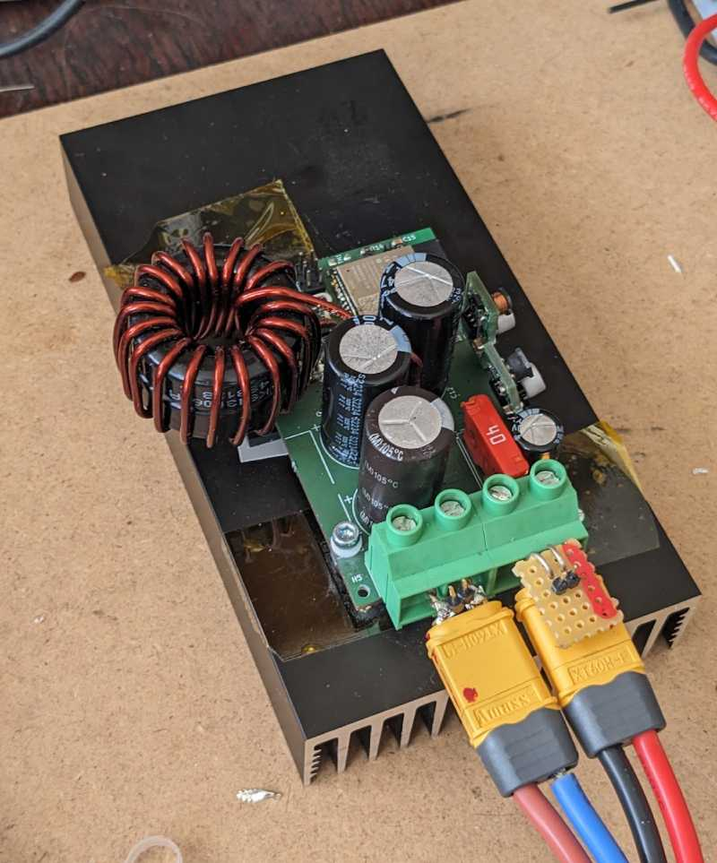

Condition:
- Vin: 61V
- Vout: 26V
- Ambient Temp: 24-25 C
- Heatsink: big
- 2p TK6R8A08QM (ir2184 and 22r gate drive)
- Coil: 2 stacked sendust cores T130 (KDM KS130-060A), 19.5 turns, 1x1.8mm wire

## lying on wood

* Average Power 760W
* heatsink equilibrium temp: 51 C

## in a cardbox

* avg power: 470W
* heatsink equi temp: 61 C
