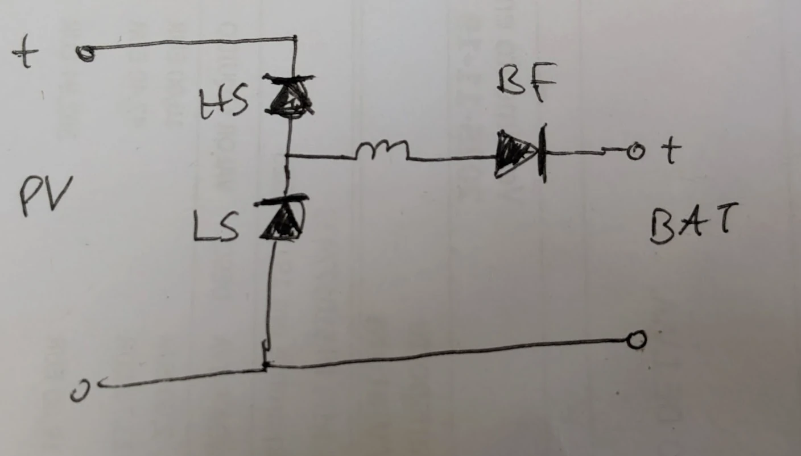

The backflow switch prevents current flow from the battery through the converter and the solar panels at night.

It ensures safe shutdown in case of shorted solar terminals.

To better understand, why it is needed, take a look at this equivalent circuit diagram of the converter, which includes
the power mosfets body diodes and the coil only:

(HS: High-side mosfet, LS: low-side MOSFET, BF: backflow switch)

## Location

There are 4 locations where the backflow switch can be placed:

* Bat(+)
* Bat(GND)
* Solar(+)
* Solar(GND)

The current at the Solar (high-voltage) side is less, so conduction loss will be lower. Notice that the
maximum blocking voltage is the battery voltage, not the solar voltage. So with 60V battery voltage, a 80V switch is
sufficient,
even with 100V solar voltag
Putting the backflow switch on the battery (low-voltage) side comes with fail-safe benefits in these 2 situations:

(1) In case of a shorted HS Mosfet, solar current will flow unregulated into the battery. With lithium batteries,
the BMS will cut charging at some point when the end-of-charge voltage is reached. Then the solar voltage is present at
battery terminals, which might destroy any connected loads.
Just opening the backflow switch will not help here, because of the body diode. We can permanently turn on the LS
switch, which will short the solar voltage and stop any battery current, protecting the charger output against over-voltage.

(2) In case of a shorted LS switch the backflow switch on the battery side can prevent a burned fuse.

