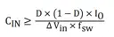

MLCC have can have poor DC bias performance, resulting capacity drop of around 80% at 80V (100V rated voltage).

https://docs.google.com/spreadsheets/d/1vxxJvD4m8UsKfiyYFJieKQtYqnGDK7agQkgYiSCFPeM/edit?usp=sharing

* X7S (and C0G ?) has lower DC-bias capacitance drop
    * good for snubbers, input caps

Electrolytic
Cin:

* (Fugu Metal)

https://www.ti.com/lit/ug/tiduej8c/tiduej8c.pdf#page=13

https://www.ti.com/lit/pdf/slyt670

|                          |      |      |     |      | 80V dc-bias |                                                                                                   |
|--------------------------|------|------|-----|------|-------------|---------------------------------------------------------------------------------------------------|
| murata GRM32EC72A106KE05 | 10uF | 100V | X7S | 1210 | -86%        | [link](https://www.murata.com/en-global/products/productdetail?partno=GRM32EC72A106KE05%23)       |
| tdk C5750X7S2A106K230KB  | 10uF | 100V | X7S |      | 2.22uF      | [link](https://product.tdk.com/en/search/capacitor/ceramic/mlcc/info?part_no=C5750X7S2A106K230KB) |
| tdk CKG57NX7R2A106M500JH | 10uF | 100V | X7R |      | 3.6uF       | 5mm MEGACAP!  expensive                                                                           |
|                          |      |      |     |      |             |                                                                                                   |

tdk has a good parametric search
https://product.tdk.com/de/search/capacitor/ceramic/mlcc/list#ref=characteristic&1a_dcbias%5Bt%5D=80&1a_dcbias%5Bl%5D=1&1a_dcbiasc_f%5Bt%5D=0.15&1a_dcbiasc_t%5Bt%5D=1&1a_dcbiasc_t%5Bl%5D=1.00E-06&_l=100&_p=1&_c=2el_dcbias_meas-2el_dcbias_meas&_d=1&_106=1

[Digikey aluminium elec. caps D=16mm](https://www.digikey.de/short/dhw78pnf) 