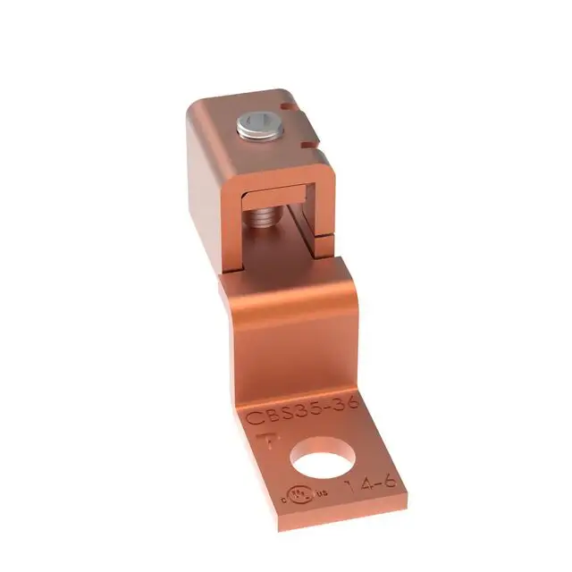

# MCU board

During prototyping and testing the MCU might get damaged (over-voltage, faulty currents, water).
Once the ESP32-WROOM is soldered to the PCB, it is tricky to remove on the field without the right tools.

For a break-out connector, we need at least these signals:

1. GND
2. 3.3V
3. ADC Vin
4. NTC
5. Half Bridge SD
6. Half Bridge HIN
7. Half bridge LIN
8. Bflow SD
9. SDA
10. SCL
11. ALERT
12. LED

- 2.54mm pitch might be too clunky
- 1.27mm appears to be a good fit
- via-less solution preferred (SMD pin headers)
- programmer interface and USB on external board

https://www.digikey.com/en/products/category/rectangular-connectors/2027

https://www.lcsc.com/product-detail/Female-Headers_HOAUC-2343U-240CNG1MNT01_C343632.html
https://www.lcsc.com/product-detail/Female-Headers_Yxcon-F136-1104S3CMUB2_C20071191.html

Samtec SSM-107-L-SV

USB-C

Standing https://www.lcsc.com/product-detail/USB-Connectors_XUNPU-TYPEC-303-ACP16_C720628.html
SMD https://www.lcsc.com/product-detail/USB-Connectors_SHOU-HAN-TYPE-C-16P-QTGM027_C2681552.html

# Power Connectors, Lugs

* preferably cross-head (Phillips) screws
* connectors with 51A or 65A have good wire gauge
  https://ihiconnectors.com/PCB-Technical-Information.htm#B2A-B2C-PCB
  https://www.digikey.de/en/products/filter/terminal-blocks/wire-to-board/371
  https://www.digikey.de/en/products/detail/amphenol-anytek/VP0285850000G/4957853
  https://www.digikey.de/en/products/detail/altech-corporation/MV-1002/9457249

Terminal Lug
CBS35-36-C
CB35-36-CY
CXS35-36-C

https://lugsdirect.com/single-wire-lugs.htm

# Standards
- UEXT
- Pmod https://digilent.com/reference/_media/reference/pmod/pmod-interface-specification-1_2_0.pdf

10 pin, 1.27mm pitch, SMD

from https://www.renesas.com/en/document/mae/ek-ra2l1-v1-users-manual?r=1398391 ::
1. Two Seeed Grove® system (I2C/Analog) connectors
2. SparkFun® Qwiic® connector
3. Two Digilent Pmod™ (SPI and UART) connectors
4. Arduino™ (Uno R3) connector
5. MikroElektronika™ mikroBUS connector