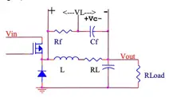
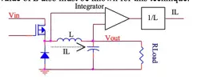
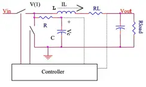
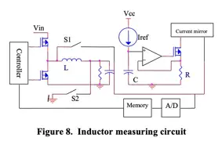
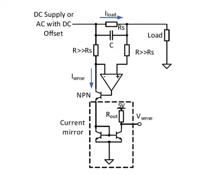
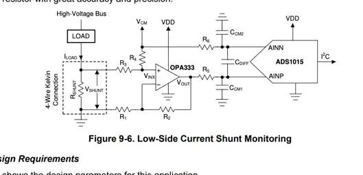
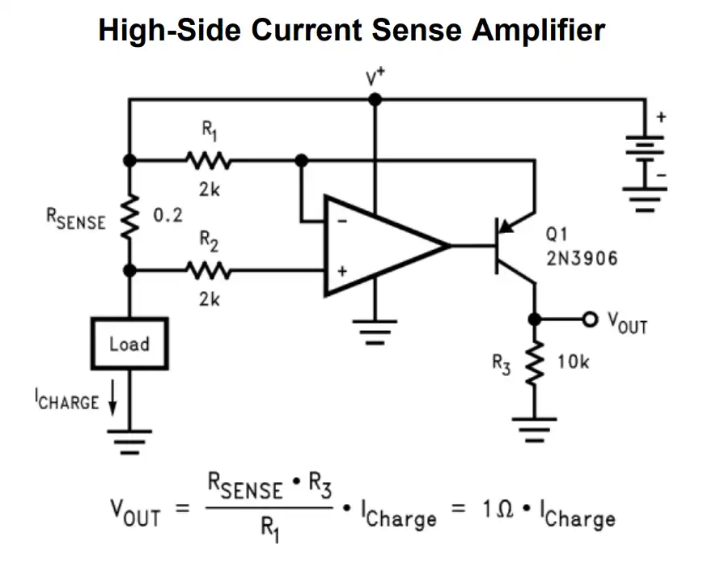
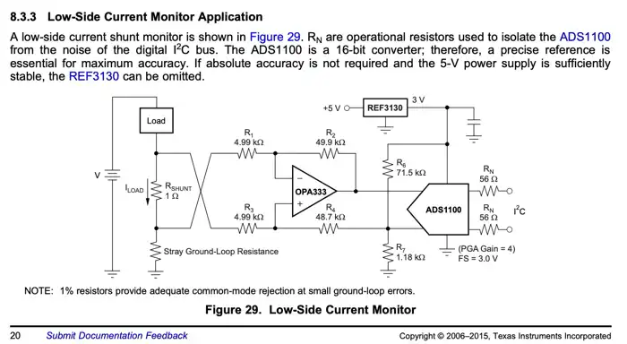

# PCB Design Notes

* Current sense: INA226 datasheet https://www.ti.com/lit/ds/symlink/ina226.pdf#page=30

# Schematics Design Notes

* Current sense filtering https://www.ti.com/lit/ds/symlink/ina226.pdf#page=14

# TODO paper about

Current-sensing techniques for DC-DC converters, H.P. Forghani-zadeh et
al. https://sci-hub.se/10.1109/MWSCAS.2002.1186927

https://rincon-mora.gatech.edu/publicat/cnfs/mw02_isns.pdf

* series sense resistor
* Rds sensing
* filter-sense inductor
* 
* 
* 
* 

|         |        | DC CMRR | CMRR @50 kHz | Gain err | TempDrift | Voff  | BW     | gains   | notes                 |
|---------|--------|---------|--------------|----------|-----------|-------|--------|---------|-----------------------|
| INA281  | +110 V | 120-dB  | 65-dB        | 0.5%     | 20ppm     |       | 1.3MHz | 20..500 | cheapest TI , $1.18   |
| INA310A | 110V   | 160dB   |              | 0.15%    | 10ppm     | 20uV  | 1.3MHz | 20..500 | int. Comparator $1.53 |
| INA310B | 110V   | 160dB   |              | 0.5%     | 20ppm     | 150uV | 1.3MHz | 20..500 | int. Comparator       |
| INA169  | 60V    |         |              |          |           |       |        |         | $1.22                 |
| INA791x |        |         |              |          |           |       |        |         | internal 50A EZ-Shunt |

Reject Noise

* 50hz inverter
* 380Hz Power supply
* 39 kHz pwm

A loss-less technique to measure average output current:
Use an RC-Filter to measure average switch node voltage. With this V_sw_avg, Vo and the coil ESR we can compute the
current.
Note that copper has temp coeff a = 0.0043/°C (https://cirris.com/temperature-coefficient-of-copper/), so a temperature
change of 30°C results about 13% error. For an MPPT this is fairly enough, not for precise energy metering though.

https://sci-hub.se/10.1109/MWSCAS.2002.1186927

INA226
INA229

# OP amp / current sense amp

the OP amp should have no Vos cross-over distortion, and a low Vos drift

* LMV931SQ3T2G (onsemi) is $0.18
* MMBT3906 (onsemi) is a SMD substitute for 2N3906 (PNP BJT, 40V, 200mA)
* for Vbat up to 60V: BC856BLT1G (65V, 100mA) or MMBT2907ALT1G (60V, 600mA) or MMBTA56LT1G (80V, 500mA), all ~300MHz

* MCP6C02 https://www.mouser.de/datasheet/2/268/Zero_Drift_65V_High_Side_Current_Sense_Amplifier_D-3444102.pdf
  * already comes with level-shift
  * 68V common mode
  * VOS: ±1.65 μV (typic
  * CMRR: 154 dB (typical)

https://www.analog.com/media/en/technical-documentation/data-sheets/ltc2063-2064-2065.pdf

from https://www.mouser.com/pdfDocs/RECOMACDCBOOKOFKNOWLEDGE.pdf#page=181
from https://recom-power.com/en/acdc-bok-chapter13-measuring.html?0 (AC/DC book of knowledge)

OPA333:

