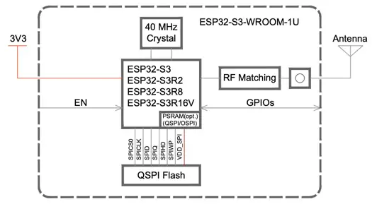

https://github.com/UnexpectedMaker/esp32s3/blob/main/schematics/schematic-omgs3.pdf

* Programming /flashing over USB
  * need BOOT button, as when chip is in panic boot loop, unable to put it in download mode over USB

Mounting the ESP32-S3 on a small break out enables easy replacement.
We can choose another chip with a different footprint.
MCU specific interfaces (USB etc) that do not belong to the board
can be moved to that break out.

KiCad SMD 2.54mm pin headers are ordinary 90deg THT headers with the odd pins
twisted. An SMD footprint of such headers can be placed inside the ESP32-S3-WROOM
footprint.
[SMD 2.54mmpin header](https://pt.farnell.com/fischer-elektronik/sl11-smd-062-40s/header-pin-2-54mm-40way/dp/9729046)

# Pin Considerations

check the [ESP32-S3 datasheet](https://www.espressif.com/sites/default/files/documentation/esp32-s3_datasheet_en.pdf)

* Vcc GND
* EN not normally not needed. The MCU can sleep and wake-up. The EN is just needed for programming
* Some pins have start up glitches (GPIO1-17 low, GPIO18-20 high!). don't use this for pwm signals
    * GPIO >= 21 for outputs
* ADC1 channels are useful (ADC2 conflicts with WiFi)
* SPI native pins?

Rust Dev Board Kicad https://github.com/esp-rs/esp-rust-board/tree/master/hardware/esp-rust-board
Power Supply https://www.espressif.com/sites/default/files/documentation/esp32-s3_datasheet_en.pdf#cd-pwr-supply

|                        | Int. Flash | PSRAM | Ambient Temp. Max |
|------------------------|------------|-------|-------------------|
| ESP32-S3-WROOM-1U-N4R2 |            |       | 85                |
| ESP32-S3-WROOM-1U-H4   |            |       | 105               |
| ESP32-S3-WROOM-1-H4    |            |       | 105               |

# Flash and PSRAM

* PSRAM resides in the ESP-S3 chip
* Flash is inside the WROOM metal enclosure, connected to the ESP32 chip with SPI
* Flash has 100k erase cycles

# Antenna Connector

* U.FL Series connector from Hirose
* MHF I connector from I-PEX
* AMC connector from Amphenol
  https://www.digikey.pt/en/products/detail/seeed-technology-co-ltd/103990623/18724506

| MPN                | Type | Freq          | Gain           | cable | Px   |                                                                                                 |
|--------------------|------|---------------|----------------|-------|------|-------------------------------------------------------------------------------------------------|
| Seeed XIAO ESP32C3 | Rod  | 2.45GHz       | 2.81dBi        |       | 2€   | [digikey](https://www.digikey.pt/en/products/detail/seeed-technology-co-ltd/103990623/18724506) |
| Ezurio MAF94045    | PCB  | 2.4GHz        | 2dBi           | 10cm  | 1.3€ | [digikey](https://www.digikey.pt/en/products/detail/ezurio/MAF94045/2392209)                    |
| Ezurio MAF95310    | PCB  | 2.45GHz, 5GHz | 2.8dBi, 3.4dBi | 18cm  | 1€   | [digikey](https://www.digikey.pt/en/products/detail/ezurio/MAF95310/5876486)                    |
| Inventek W24P-U    | PCB  | 2.4GHz        | 3.2dBi         | 9cm   | 1.3€ | [digikey](https://www.digikey.pt/en/products/detail/inventek-systems/W24P-U/4488778)            |
| Inventek W2.4-5P-U | PCB  | 2.4GHz, 5Ghz  | 2.6dBi, 3.3dBi | 9cm   | 1.5€ | [digikey](https://www.digikey.pt/en/products/detail/inventek-systems/W2-4-5P-U/4965325)         |
| Fanstel ANT060     | Rod  | 2.45GHz       | 6dBi           | 10cm  | 2.9€ | [digikey](https://www.digikey.pt/en/products/detail/fanstel-corp/ANT060/8323643)                |

# Dev Boards
https://www.waveshare.com/esp32-s3-zero.htm
https://github.com/femtoduino/femu-hardware/tree/master/femu/kicad/femu
esp32-rust

