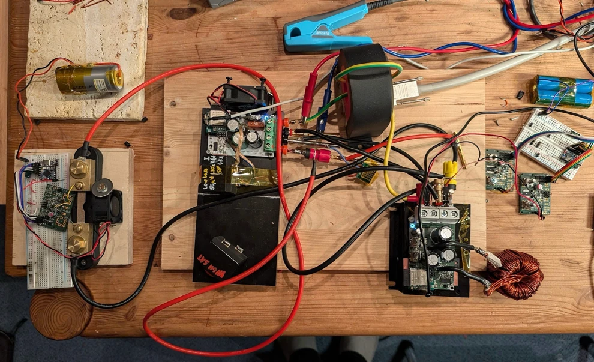

# Power-loop test rig

I build this test rig to test & measure DC-DC converters.
It runs from a 27V, 3A power supply and uses a boost converter to create a higher voltage.
This voltage is then fed into the buck DUT, and the output of the buck is fed back into the boost input.
This way we can test converters up to 1000W, with only ~60W of supply and without any super expensive bi-directional
power supplies.

* Supply power: 27V
* High voltage output (source): 15 ~ 80V
* Low voltage input (sink): 12 ~ 60V
* Max current: 38A
* Max power tested: 1000W

## Boost Converter

The boost runs in forced PWM mode for good voltage regulation. Additional we can put 1 or 2 isolated power modules
(such as the BMR6852300/001) to decouple the inputs and outputs. Without isolation, any ground-side current measurement
will be just garbage, so we need to measure the high-side currents.
The isolated modules will probably inject some noise, which can affect precision measurements.
I placed a 86V TVS (PTVS1-086C-H) at the boost output to suppress excessive overvoltage.

PWM signals of the boost and the DUT should be synchronized, otherwise any clock drift can cause significant
current noise/oscillation.

## Voltage Sensors

I use two INA228 chips (20bit power monitor) measure voltage at the DUT input terminals (aka 4-Wire Kelvin-Connection).

I've tested INA228 chips from Digikey and they perform quite well (I had bad experience with a chip from LCSC that
showed 500mV offset on the Vbus channel). I used a (broken → drifting) HP3458A and a DMM6500
as references. I ran frequent `ACAL DCV` on the HP3458A, because it has some serious drift issues. INL error when
comparing the 3458A and the DMM6500 was around <2ppm, in the 20-80V range (my power supply was noisy, want to build a
programmable low-noise PSU like drafted in
the [OPA187 datasheet](https://www.ti.com/lit/ds/symlink/opa187.pdf#page=25)).

Before I took measurements, I calibrated gain and offset of both chips to each other. Absolute voltage values
do not matter here, because we are interested in efficiency, which is computed from voltage and current ratios.
I estimate the accuracy of voltage ratio measurements with the two INA228 chips to be better than 10ppm.
More documentation [here](https://github.com/fl4p/pwr-metering/tree/main/doc/ina228-char).

## Current Sensors

For the LV side I use a Danisense DS200ID DCCT with 2 primary turns and the measure DCI with the HP3458A.
I am planning to use VPG Y16905R00000Q9L as burden resistor for the DCCT output to be able to use a voltmeter.

On the HV side I use Riedon RSN20-50 and a INA228.

* Vbus crosstalks to shunt input channel. For best accuracy use one INA228 for Vbus and another for shunt measurement
* forced air cooled
* linearity calibrated with 2nd order polyfit
* gain and offset calibrated
* estimated INL<100ppm

* DUT: ftall
    * high-side switch: 2p IPA050N10NM5S
        * gate drive: 4.7R
    * low-side switch: 2p ???
    * coil: core: 2 stack MS184075, 14 turns, 9 strands, 1.8mm copper wire coil
  * Vin=71.5 Vout=27.1 Iout=29.1A
      * efficiency: 98.12% (+-0.02% uncertainty)
