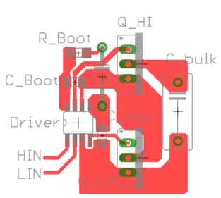

## Driver

- for prototyping use a higher current driver. after you found gate drive resistors that make you happy you can
  eventually
  downgrade the driver IC to a cheaper model
- a driver IC with programmamble dead-time

## Gate drive resistor

https://electronics.stackexchange.com/questions/60427/calculating-the-pulldown-resistance-for-a-given-mosfets-gate#_=_

# PCB

- 10 nH/cm

* STP110N8F6_V2:  Ldrain= 1nH ,Lsource=2nH and Lgate=2.5nH

parallel fets:
-put resistors close to driver for reduced parasitic inductivity TODO spice

https://resources.altium.com/p/stripline-vs-microstrip-understanding-their-differences-and-their-pcb-routing-guidelines

https://www.analog-praxis.de/abschaetzung-der-induktivitaet-von-leiterbahnen-a-535549/

https://www.semanticscholar.org/paper/Driver-Requirement-for-Power-MOSFET%3A-A-Practical-Rai-Tandon/27aac3350b2e4e10813b053fb11e272d462ddf16

# Driver IC

for prototyping, use a chip with programmable dead-time

[digikey search](https://www.digikey.de/en/products/filter/isolators-gate-drivers/906), 2ch, output peak current >2A,
sort by ascending price

| mfr      | mpn            | package      | I       | DT    | isolation |         |
|----------|----------------|--------------|---------|-------|-----------|---------|
| infineon | IRS2184        | SOIC-8       | 1.9     | 500ns | funct     |         |
|          | 2ED2182        | SOIC-8       | 2.5     | 400ns | funct     |         |
|          | IRS21867S      | SOIC-8       | 4       | -     | funct     |         |
|          | 2EDL8124G      | PG-VDSON-8-4 | 4       | STP   | funct     |         |
|          | 2ED2748S01G    | VSON-10      | 4       | 30ns  | funct     |         |
|          | 2ED3144MC12L   | 6            | 6       | prog  |           | 2.44 €  |
|          | 2EDB7259K      | 13-LGA       | 5/9     | prog  | galvanic  |         |
|          | 2EDS8265H      |              |         |       |           |         |
|          | 2EDB8259F      | SOIC-16      | 5/9     | prog  | funct     | for GaN |
|          | LM5100A        | SOIC-8       | 3       | -     |           |         |
|          |                |              |         |       |           |         |
| ti       | UCC21330BQDRQ1 | SOIC-16      | 4/6     | prog  |           | 1.43 €  |
|          | lm5107         |              | 1.4/1.3 |       | 100V      | 1.3$    |

2EDB8259Y
2EDR8259X

2EDB8259E

UCC21330BQDRQ1 is a pick:

- cheap
- universal: halfbridge, dual high
- programmable DT
- LO/HI/SD inputs
- 9ns rise/fall time
- 4 A peak source current

onsemi NCP5183

# Bootstrap Diode

Selection:

* high voltage (>=1.5x of DC-Link)
* fast recovery
* maybe SiC Schottky
* low forward voltage
* low junction capacitance → low reverse recovery → low grounding noise bounce (negative GND voltage)

| MPN                                                                                          | Px    | V_max | I    | Vf_max25 | Qc   | C(Vr=0) | trr  | notes              |
|----------------------------------------------------------------------------------------------|-------|-------|------|----------|------|---------|------|--------------------|
| [1N4148](https://www.diodes.com/assets/Datasheets/BAV16W_1N4148W.pdf)                        | 0.1€  | 100V  | 0.3A | 1.25V    |      | 2pF     | 4ns  | General Purpose    |
| [C4D02120E](https://assets.wolfspeed.com/uploads/2023/10/Wolfspeed_C4D02120E_data_sheet.pdf) | 1.0€  | 1200V | 10A  | 1.8V     | 11nC | 167pF   | 0    | SiC, UCC21330x PDF |
| [MURS140](https://www.vishay.com/docs/88688/murs140.pdf)                                     | 0.12€ | 400V  | 1A   | 1.25V    |      | 50pF    | 50ns |                    |
| [SS310](https://www.snapeda.com/parts/SS310/Taiwan%20Semiconductor/datasheet/)               | 0.14€ | 100V  | 3A   | 0.85V    |      | 120pF   | 0    | Schottky           |

# Gate Discharge Diodes (Turn-Off Diode)

[TI: Fundamentals of MOSFET and IGBT Gate Driver Circuits](https://www.ti.com/lit/ml/slua618a/slua618a.pdf#page=19)

* Vg_th should be less than Vfwd of the diode
* small resistance
* small parasitic capacitance
* schottky preferred (no reverse recovery)

| MPN          | Vr   | I    | Ipeak | Vf   | C(4V) | trr  | Px(100) | notes                                                                                                           |
|--------------|------|------|-------|------|-------|------|---------|-----------------------------------------------------------------------------------------------------------------|
| MSS1P4       |      | 1A   | 25A   | 0.41 | 50pF  |      | 0.07€   | schottky                                                                                                        |
| B540C        |      | 5A   | 100A  |      | 300pF |      | 0.2€    | schottky                                                                                                        |
| SS310        |      | 3A   | 75A   |      | 85pF  |      |         | 100V                                                                                                            |
| SS315        |      | 3A   | 75A   |      | 55pF  |      |         | 150V                                                                                                            |
| 1N4148       |      |      |       |      |       |      |         |                                                                                                                 |
| BAS40        |      |      |       |      |       |      |         |                                                                                                                 |
| RB160MM-40TR |      | 1A   | 30A   |      | 90pF  | 12ns | 0.14€   | [pdf](https://fscdn.rohm.com/en/products/databook/datasheet/discrete/diode/schottky_barrier/rb160mm-40tr-e.pdf) | 
| BAS3010B     |      | 1    | 3.5A  |      | 33pF  |      | 0.16€   |                                                                                                                 |
| BAS100CS     | 100V | 0.5A |       |      |       |      | 0.09€   | from RAA211803 datasheet                                                                                        |
|              |      |      |       |      |       |      |         |                                                                                                                 |
|              |      |      |       |      |       |      |         |                                                                                                                 |
|              |      |      |       |      |       |      |         |                                                                                                                 |

: 1A

TI: Fundamentals of MOSFET and IGBT Gate Driver
Circuits https://www.ti.com/lit/ml/slua618a/slua618a.pdf?ts=1691532999585