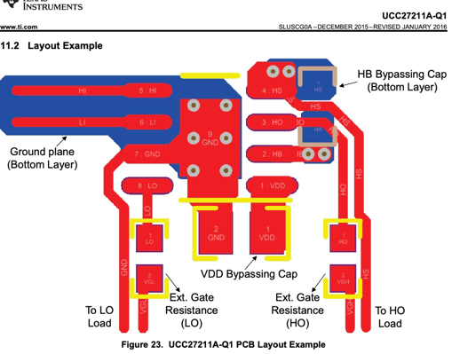

## Driver

- for prototyping use a higher current driver. after you found gate drive resistors that make you happy you can
  eventually
  downgrade the driver IC to a cheaper model
- a driver IC with programmamble dead-time

## Gate drive resistor

https://electronics.stackexchange.com/questions/60427/calculating-the-pulldown-resistance-for-a-given-mosfets-gate#_=_

# PCB

- 10 nH/cm

* STP110N8F6_V2:  Ldrain= 1nH ,Lsource=2nH and Lgate=2.5nH

parallel fets:
-put resistors close to driver for reduced parasitic inductivity TODO spice

https://resources.altium.com/p/stripline-vs-microstrip-understanding-their-differences-and-their-pcb-routing-guidelines

https://www.analog-praxis.de/abschaetzung-der-induktivitaet-von-leiterbahnen-a-535549/

https://www.semanticscholar.org/paper/Driver-Requirement-for-Power-MOSFET%3A-A-Practical-Rai-Tandon/27aac3350b2e4e10813b053fb11e272d462ddf16

# Driver IC

for prototyping, use a chip with programmable dead-time

[digikey search](https://www.digikey.de/en/products/filter/isolators-gate-drivers/906), 2ch, output peak current >2A,
sort by ascending price

| mfr      | mpn            | package      | I   | DT    | isolation |         |
|----------|----------------|--------------|-----|-------|-----------|---------|
| infineon | IRS2184        | SOIC-8       | 1.9 | 500ns | funct     |         |
|          | 2ED2182        | SOIC-8       | 2.5 | 400ns | funct     |         |
|          | IRS21867S      | SOIC-8       | 4   | -     | funct     |         |
|          | 2EDL8124G      | PG-VDSON-8-4 | 4   | STP   | funct     |         |
|          | 2ED2748S01G    | VSON-10      | 4   | 30ns  | funct     |         |
|          | 2ED3144MC12L   | 6            | 6   | prog  |           | 2.44 €  |
|          | 2EDB7259K      | 13-LGA       | 5/9 | prog  | galvanic  |         |
|          | 2EDS8265H      |              |     |       |           |         |
|          | 2EDB8259F      | SOIC-16      | 5/9 | prog  | funct     | for GaN |
|          | LM5100A        | SOIC-8       | 3   | -     |           |         |
|          |                |              |     |       |           |         |
| ti       | UCC21330BQDRQ1 | SOIC-16      | 4/6 | prog  |           | 1.43 €  |

UCC21330BQDRQ1 is a pick:

- cheap
- universal: halfbridge, dual high
- programmable DT
- LO/HI/SD inputs
- 9ns rise/fall time
- 4 A peak source current

onsemi NCP5183

