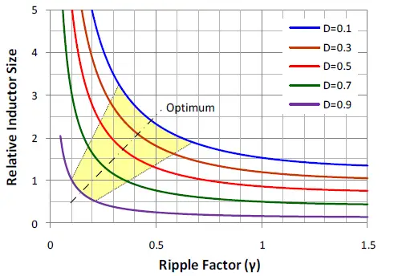

https://wfm-publish.blaetterkatalog.de/frontend/mvc/catalog/by-name/ELE?catalogName=ELE2415D

# materials

- https://www.cwsbytemark.com/mfg/sendust.php

* much lower core loss iron powder
* very high saturation level
* a little more expensive

material selection is a trade-off between core loss and saturation.
care must be taken about temperature dependency of A_l and core saturation.
TODO Sendust inductivity coefficient

MPP: low core loss
high flux: slightly lower loss than sendust. applications with high DC-bias current. limited choices

# Off-the-shelf inductors

many off-the-shelf inductors have flat wire winding for decreased ESR. with optimal copper/air ratio manufactureres
can make coils with different inductance values but the ESR and package size.
despite the heavy price tag, it might be useful to take a look what coils are available on digikey.
this way you can learn about whats physically possible, the data-sheet contain useful information
and might even give a clue about expected core loss.

https://content.kemet.com/datasheets/KEM_LF0051_SHBC.pdf

* SHBC Series (Fe-Si-Al)
  SHBC24N-2R1B0039V 30 39 21.2 6.8 50 2.1 x 2 Parallel 135
  SHBC24W-2R1B0065V 30 65 40.7 6.2 50 2.1 x 2 Parallel 217
* why does the 65uH parts has a lower ESR?
* price100: $12

| MFR       | MPN             | px100 | L | DCR | Isat10/20/30 | DC bias 30A                                          |
|-----------|-----------------|-------|---|-----|--------------|------------------------------------------------------|
| würth     | 7443763540470   |       |   |     |              |                                                      |
| codaca    | CPEX4141L-500MC | $25   |   |     | ?/?/44A      | 90% https://www.codaca.com/Private/pdf/CPEX4141L.pdf |
| coilcraft | AGP4233-223ME   |       |   |     |              |                                                      |
| itg       |    L201316Q-470MHF             |       |   |     |              |                                                      |

[digikey](https://www.digikey.de/short/vhjtjb2n)

core size vs ripple https://www.richtek.com/Design%20Support/Technical%20Document/AN009#Ripple%20Factor
