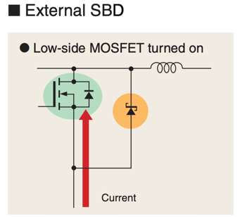
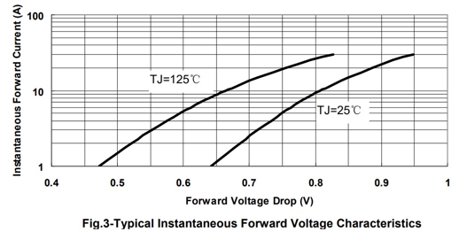
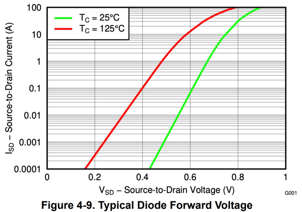
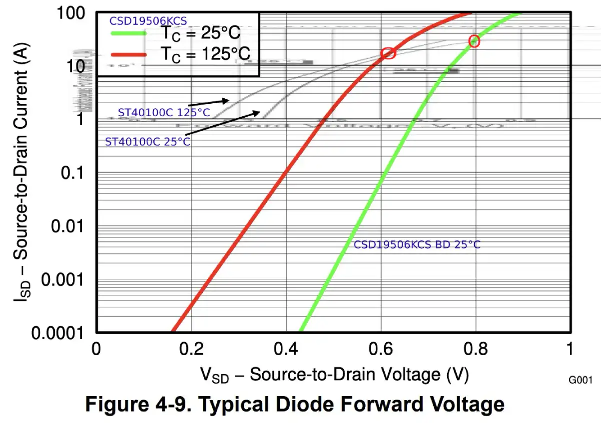
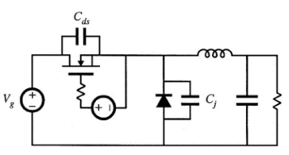
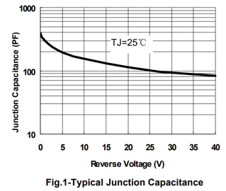

# Increasing sync buck efficiency with a diode



A Schottky diode in parallel to the LS switch can increase power conversion efficiency of the buck converter:

1. A Schottky diode with lower forward voltage than the MOSFETs body diode will decrease losses during dead-time.
2. Potential decrease or complete elimination of reverse recovery losses if the. Schottky have neglitable turn-on losses

A diode can incorporate additional losses to the system:

* For PN-Diodes, during HS turn-on (diode turn-off), the reverse voltage can cause reverse recovery. Schottky diodes do
  not suffer from this. (
  see [Losses in Power Diodes.](https://lemuruniovi.com/wp-content/uploads/2021/03/Losses-in-Power-Diodes.pdf))
* parasitic junction capacitance (see below)
* parasitic inductances between external diode and mosfet can cause mosfet self turn-on and additional conduction loss (
  see [Toshiba Mosfet Product Guide 2009](https://www.mouser.com/datasheet/2/408/toshiba%20america%20electronic%20components,%20inc._bce008-1209380.pdf#page=18))

For lowest losses in a sync buck, the diode should then have these characteristics:

* Schottky barrier diodes (no PN reverse recovery)
* Low forward-voltage to prevent MOSFET body diode turn on (MOSFET reverse recovery)
* Lower forward-voltage than MOSFET to reduce conduction loss during dead-time
* small lead inductance, SMD

Schottky diodes can have a significant junction capacitance, which looks similar to the reverse recovery effect of the
body diode, but at a smaller
magnitude (https://ez.analog.com/ez-blogs/b/engineerzone-spotlight/posts/how-a-small-schottky-diode-minimizes-noise-in-synchronous-converters)

## CSD19506KCS and ST40100C





Here's a V-I-plot of the CSD19506KCS mosfet body diode and ST40100C overlay:



^ Diode forward voltage of CSD19506KCS and ST40100C in an overlay-plot.
At 25°C ST40100C's fwd voltage is lower up to to ~28A.
At 125°C the curves cross at ~15A.

## Diode Selection

https://www.digikey.de/short/382502p8

|                     |         | Vpeak | Iav    | Ipr   | Vf_typ @25°15A  | Vf_max_125 | Ct_typ(5V)            |                                                                                           |
|---------------------|---------|-------|--------|-------|-----------------|------------|-----------------------|-------------------------------------------------------------------------------------------|
| ST40100C            |         | 100V  | 2*20A  |       | 0.65            | 0.7        | 845pF *2              |                                                                                           |
| ST10100S            |         | 100V  | 15A    |       | 0.68            |            |                       |                                                                                           |
| ST20100S            |         | 100V  | 20A    |       | 0.67            |            |                       |                                                                                           |
| ST15100S            | TO-277B | 100V  |        |       | 0.68            |            |                       |                                                                                           |
| ST3050DJF           |         |       |        |       |                 |            |                       |                                                                                           |
| MBR30200CT (smc)    |         | 200V  | 2*15A  | 20A*2 | 0.85  (0.9 max) | 0.75       | 200pF  *2 (400pf max) | [pdf](https://www.smc-diodes.com/propdf/mbr30200ct(-1)%20mbrb30200ct%20n0769%20rev.a.pdf) |
| STPS60170C          |         | 170V  | 2*30A  |       | 0.94 (max)      | 0.76       | 1200pF *2             | https://www.st.com/resource/en/datasheet/stps60170c.pdf                                   |
| mcc MBR20200CT      |         | 200V  | 2*     |       |                 |            |                       |                                                                                           |
| mbr30200ct (diotec) |         | 200V  |        |       | 0.97            |            | 700pF *2              | https://diotec.com/request/datasheet/mbr30100ct.pdf                                       |
| mbr30150ct (diotec) |         |       |        |       | 0.85            |            | 700pF *2              |                                                                                           |
| UF160FCT (panjit)   |         | 200V  |        |       | 1.0             |            | 170pF *2              | trr=50ns       https://www.panjit.com.tw/upload/datasheet/UF1600FCT_SERIES.pdf            |
| MBRD20200CT (smc)   |         | 200V  | 2*10A  |       | 0.95            |            |                       |                                                                                           |
| MBR3040FCT          |         | 200V  | 2*15A? |       | 0.88            |            | ???                   | https://www.panjit.com.tw/upload/datasheet/MBR3040FCT_SERIES.pdf                          |
| 16CTQ150(smc)       |         | 150V  | 2*8A   |       | 0.82            |            | 400pF                 | https://www.smc-diodes.com/propdf/16CTQ150(S)(-1)%20N0667%20REV.A.pdf                     |
| RB228NS150          |         | 150   | 300    |       | 0.82 (0.88 max) |            |                       |                                                                                           |
|                     |         |       |        |       |                 |            |                       |                                                                                           |

# Power Diode Losses

## Reverse Recovery Loss

Schottky diodes have almost no reverse recovery.

## Junction Capacitance Loss

Junction capacitance can be modeled with a capacitor parallel to the diode:



Charging the capacitor causes power loss, as it current flows during HS turn-on.
The energy stored in the parasitic capacitance is mostly recovered into the coil during LS diode turn-on, however the
inefficient resistive charging across the HS already wastes most of the energy. TODO.

This power loss is proportional ~ V**1.5 and usually only significant for voltages > 100V.

(From Fundamentals of Power Electronics, Robert W. Erickson, Fig 4.52)

Ct depends on Vr. The higher the reverse voltage is, the lower the capacitance:



In "Fundamentals of Power Electronics" 4.3.3 (pg 98): C(V) ~ 1/√V
C(V) ~= C0 * √(V0/V) (V0, C0 part constants, pg 81ff)
C(V) ~= C0'/√V      (Eq 4.5)
C0' = C0 * √V0

C0' can be found in the datasheet from a single point of the Ct-chart.

For the MBR30200CT we read:

| V  | C     | C√V |
|----|-------|-----|
| 2  | 300pF | 424 |
| 5  | 200pF | 447 |
| 10 | 150pF | 474 |
| 25 | 100pF | 500 |

Due to reading errors and because the 1/√-dependency is just an approximation, the C√V is not constant.

So let's do a quick `scipy.curve_fit`:

```
from scipy.optimize import curve_fit
f = lambda v,c0p,e: c0p * (v ** e)      # the C(V) model
xdata = (2,5,10,25)                     # from MBR30200CT datasheet
ydata = (300e-12,200e-12,150e-12,100e-12)
popt, pcov = curve_fit(f, xdata, ydata)
c0p, e = popt
# c0p = 405e-12 [F√V], e = -0.43
```

C(v) ~= 405 * v^-0.43 (for the MBR30200CT).

A lazy alternative would be to read the `C0' ~= C(~0)` from the chart and assume `e = -0.5` .

Now we can integrate v*C(v) over v=0..V to find the total energy stored during turn-on off the HS switch:

```
v*C(v) = v * C0' * v^e = C0' * v^(1+e)
```

Energy lost during HS turn-on:

```
W(V) = C0' * V**(2+e) / (2+e)
# MBR30200CT: W(V) = 405e-12 * V**1.57 / 1.57
```

Average power loss:

```
P(V,fsw) = fsw * C0' * V**(2+e) / (2+e)

# MBR30200CT: P(100V,40khz) = 14mW
```

Using the lazy simplification:

```
P(V,fsw) = fsw * C(~0V) * V**1.5 / 1.5
# MBR30200CT: P(100V,40khz) = 11mW   (25% err)
```

## Conduction

Forward voltage of Si Schottky diodes decreases with rising temperature.

## References:

* https://lemuruniovi.com/wp-content/uploads/2021/03/Losses-in-Power-Diodes.pdf
* Fundamentals of Power Electronics, Ed. 2001, Robert W. Erickson, Dragan Maksimović, Springer US, ISBN 9780306480485
* https://u.dianyuan.com/bbs/u/41/1148348695.pdf