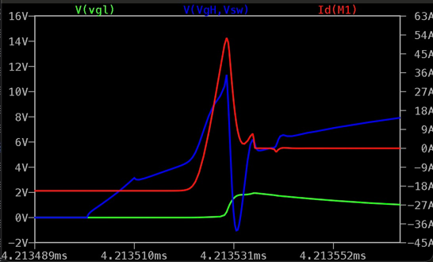
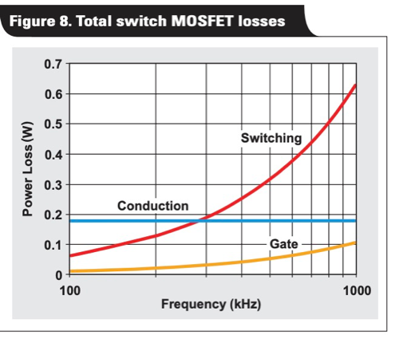

# Selection of mosfets

Most losses in a dcdc converter happens in the switches and the coil. Higher switching frequency increase switching
losses, but reduces coil loss, because smaller inductivity is needed thus less coil wire loss.

In a sync buck topology the HS-Switch (aka control, switch fet) and the LS (sync fet) operate
in quite different conditions.

In CCM mode the current through the LS switch always flow from source to drain in the
direction of the body diode, whereas on the HS switch conducts current the opposite way from drain to source.

Consequently, the LS suffers from self turn-on caused by HS and the HS suffers from LS's reverse recovery
charge.

Reducing switching times does not necesarilly steer to optimum efficiency, because it can cause self turn-on.
Poor performance of one switch can heat up the other.
With that having in mind, let's take a closer look into the losses in the mosfet.

## Conduction Loss

This is straightforward, lower Rds_on will have lower conduction loss.
The average loss is `R_ds_on * I² * D` where `D` is the duty cycle.

## Switching loss (HS)

Current that flows during turn-on, until Rds reaches Rds_on, causes significant power loss in the switch.
Faster on and off switching reduces this loss. Mosfets datasheet specify rise time (tr) for turn-on and fall time (tf)
for turn-off. Choose low gate drive resistor and mosfet with low Qg (Qsw). Note that low gate resistors can cause
instabilities due to ringing gate and LS self-turn on (see below).
Faster switching poses more stress on the input capacitors on increases loss in their ESR.

Switching loss at the LS are negligible because it switches with powered body diode.

[This rohm AN](https://fscdn.rohm.com/en/products/databook/applinote/ic/power/switching_regulator/power_loss_appli-e.pdf
) presents calculations for power loss estimations.


*^ Composition of
Qg [[src](https://www.infineon.com/dgdl/Infineon-IPB019N08N3-DS-v02_03-en.pdf?fileId=db3a30431add1d95011ae87fdf90569f)]*

## Self turn-on loss (caused by LS)

The LS is prone to self-turn-on caused by high du/dt from short HS switching times. Note that this loss is dissipated in
both HS and LS switch depending on there current R_ds. Most of the heat goes to HS.

At the HS there is no self-turn-on because parasitic gate capacitances Cgd/Cgs are charged inversely (
see [this EETimes article](https://www.eetimes.com/how-fet-selection-can-optimize-synchronous-buck-converter-efficiency/)).



*^ Waveform of LS gate voltage, HS gate voltage and LS drain current.

## Qrr loss (caused by LS)

High reverse recovery charge Qrr in the HS body-diode causes ringing. Higher gate drive resistors RC-Snubbers help
here.

Reverse recovery in the LS is discussed in
the [eetimes article](https://www.eetimes.com/how-fet-selection-can-optimize-synchronous-buck-converter-efficiency/
) and in
a [nexperia article](https://efficiencywins.nexperia.com/efficient-products/qrr-overlooked-and-underappreciated-in-efficiency-battle
). Note that this loss is dissipated in the HS switch during its turn-on.

ringing wave form https://www.ti.com/lit/an/slpa010/slpa010.pdf#page=2
Causes Voltage peak V_sw and EMI.


*^ Diode Reverse
recovery [[src](https://www.aosmd.com/res/datasheets/AONS66811.pdf#page=6)]*

[TI Video on Reverse Recovery](https://www.ti.com/video/6243277597001)

## Figuring the FET

Now lets think about what properties good HS and LS FETs should have.

Remember these losses:

- HS switching loss
- HS and LS conduction loss (`R_ds * I²`), distribution depends on the duty cycle D.
- LS self turn-on (cause shoot-through current and losses in both HS and LS)

See [Toshibas Mosfet Guide](https://mm.digikey.com/Volume0/opasdata/d220001/medias/docus/379/Mosfets_Prod_Guide.pdf#page=16)
for a visualization of these losses in a timing chart.
It features the TPCA8028-H.

Fast HS switching conflicts with LS self turn-on, so the shortest HS rise time will not nececarilly

# TODO happily article, nesesarally FOM best, mosfet selection

self-turn on

LS:

- low body diode forward voltage (most fets have ~1V)
- low Qgd/Qgs ratio to avoid sell-turn on
- Low r_g

HS:

- Low Q_SW
- Low Q_rr
- Low r_g

EMI:
LS self turn-on loss and any



[[src](https://www.ti.com/lit/an/slyt664/slyt664.pdf?ts=1722820278050)]

# SPICE

-

ltspice [add mosfet model](https://www.analog.com/en/resources/technical-articles/ltspice-using-an-intrinsic-symbol-for-a-third-party-model.html)

- replacing the LS with a schottky diode (MBR30100CT) helps evaluating the HS performance, since a diode has no self
  turn-on and does not suffer from reverse recovery (see [ti video](https://www.ti.com/video/6243277597001))
- you can find SPICE models on the manufacturer website
- V(Vi,Vsw)*Ix(U2:1)+V(VgH,Vsw)*Ix(U2:2)

# Losses

40khz, 500ms DT,
inspection of power plots using the integration tool:

```
uJ
                self-turn-on  sw-on   sw-off   RDS    RR      BD   BD turn on, charge up?
CSD19506KCS H  ~2.6           20       21      30     TODO                    uJ
AONS66811   L   2.6           1.2      0       12             11   2.6        uJ
```

#Mosfet Picks:
Vds Rds Qg tRise tFall Qrr

| MPN        | Vds | Rds_max | Qg  | tRise | tFall | Qrr | comment                         |
|------------|-----|---------|-----|-------|-------|-----|---------------------------------|
| STP110N8F6 | 80  | 6.5     | 150 | 61    | 48    | 34  | very low Qrr, SPICE model buggy |  
| TK2R4A08QM | 80  | 2.4     | 179 | 91    | 95    | 100 | good HS                         |
| TK3R2A08QM | 80  | 3.2     | 102 | 78    | 79    | 69  | good LS                         |
|            |     |         |     |       |       |     |                                 |
|            |     |         |     |       |       |     |                                 |
|            |     |         |     |       |       |     |                                 |
|            |     |         |     |       |       |     |                                 |

,

in this case CSD19506KCS switching loss is 41 and RDS 30

Takeaways

- self-turn-on loss is low
- LS Rds loss is ~ Body diode Loss during dead time -> fit dead time
- ratio of HS sw/Rds loss is 4:3

# TODO

[MOSFET power losses and how they affect power-supply efficiency](https://www.ti.com/lit/an/slyt664/slyt664.pdf?ts=1722820278050#page=3)

https://eepower.com/technical-articles/rethinking-the-power-mosfet-figure-of-merit/#

# Parallel Switches

Parallel HS:
Due to variations from the manufacturing process, one switch will take all the switching loss.
RDson loss is 1/4. Adds to gate drive current. (FOM)

Parallel LS:
Adds to gate drive current. (FOM)
Adds Qrr loss. (FOMrr)

Placing a second LS of the same model in parallel will reduce conduction loss to a half but doubles the reverse
recovery loss (in the HS switch).

