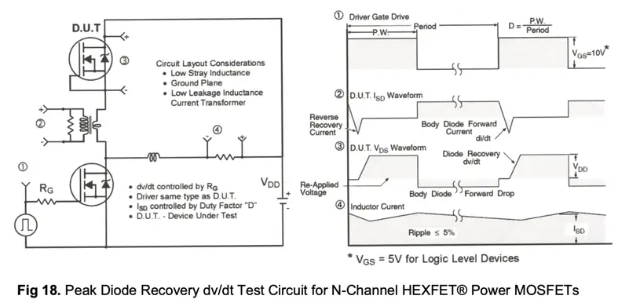

TODO subject to review:

# 1. HS Turns on
- LS reverse recovery (C_rr discharges)
  - ringing switch-node
- LS self turn on
- HS miller effect

# 2. HS Turns off and LS body diode turns on
- Vsw falls from Vi to -1V (LS body diode Vsd)
- LS Coss discharged, mosfet releases energy (-3.3913µJ)
- LS body diode power ups (C_rr charges)
- Vsw is now 1V below ground

# 3. LS Turns on
- Vsw goes from -1V to GND
- Current spike in LS drain and HS drain

# 4. LS Turns off
- Vsw GND -> -1V
- C_rr charged

AUIRFS/SL4115