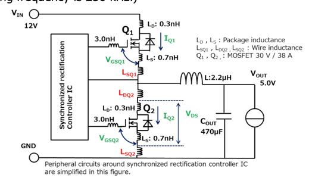

https://fscdn.rohm.com/en/products/databook/applinote/discrete/sic/mosfet/sic-mos_snubber_circuit_design_an-e.pdf

## Toshiba: [RC Snubbers for Step-Down Converters](https://toshiba.semicon-storage.com/info/application_note_en_20180901_AKX00078.pdf?did=63595)

* RC-Snubber design for buck DC-DC converters
* Snubber simulation
* Calculate parasitic inductance
* Impedance matching

