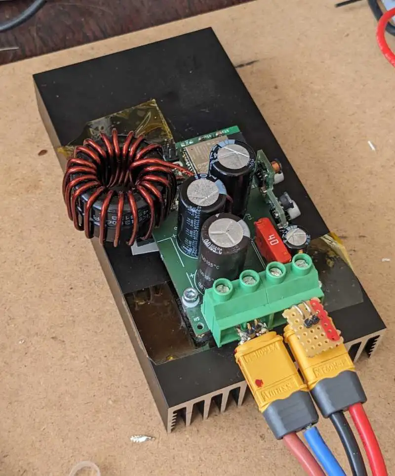

Condition:
- Vin: 61V
- Vout: 26V
- Ambient Temp: 24-25 C
- Heatsink: 160 x 83 x 25 AK-EL83-160
- 2p TK6R8A08QM (ir2184 and 22r gate drive)
- Coil: 2 stacked sendust cores T130 (KDM KS130-060A), 19.5 turns, 1x1.8mm wire

## lying on wood

*^the coil get very hot^*

* Average Power 760W
* heatsink equilibrium temp: 51 C

## in a cardbox

* avg power: 470W
* heatsink equi temp: 61 C

## T180 Coil
* 15.5 turns, 2x1.8mm wire
* avg power (in the card box): 483W  (+13W than with other coil)

*^ No forced cooling ^*

*^ Cooled with a fan ^*

# Thermal meltdown
* running for an hour, Vin=75V, Vout=27, Iout=32A
* on 10x10 cm heatsink

temperature measured with TMP117 attached to heatsink:

* the HS melted at arround 00:28
* not sure what happend at 00:08
* i adjusted the output power manually to keep the temperature at 80°C, which worked for 40minutes
* then temperature dropped, and increased. 

