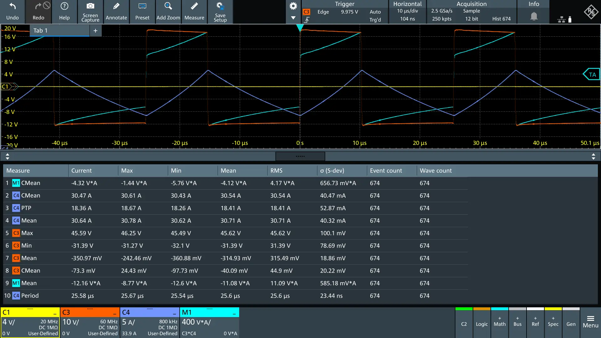
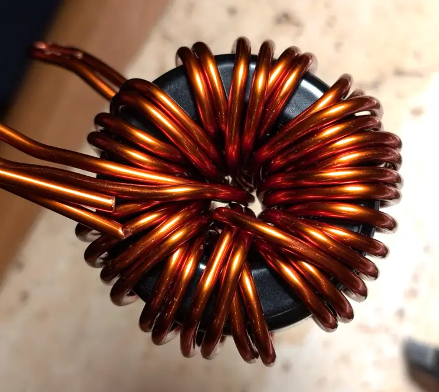
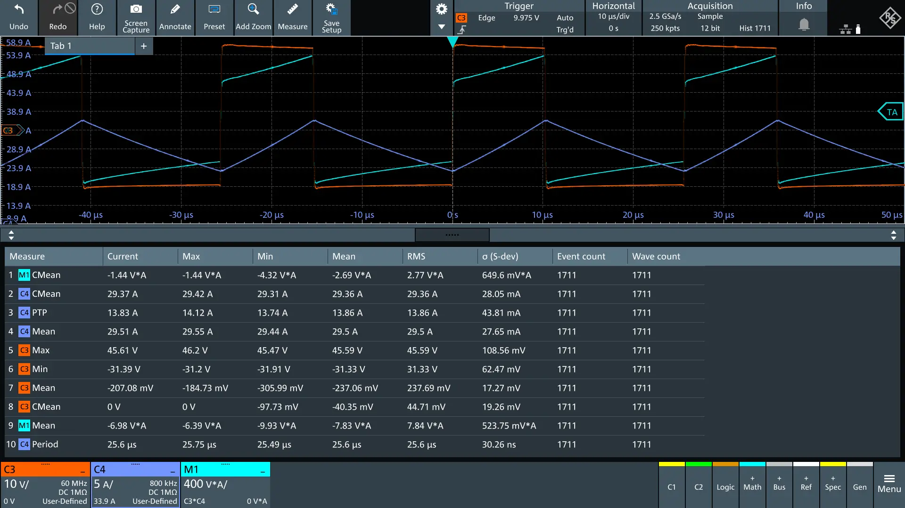
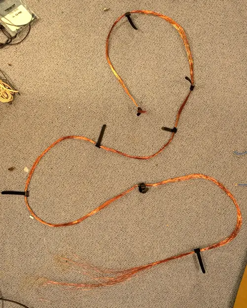
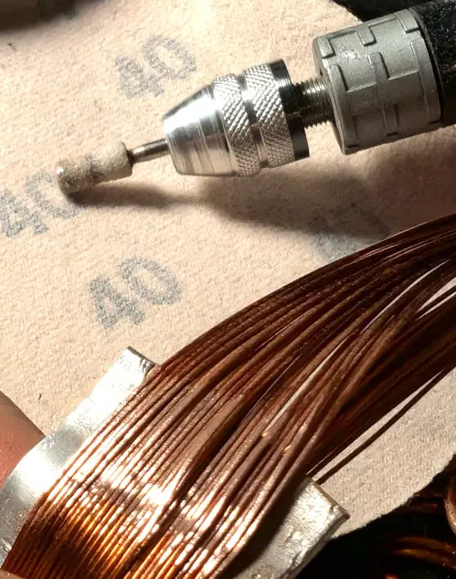
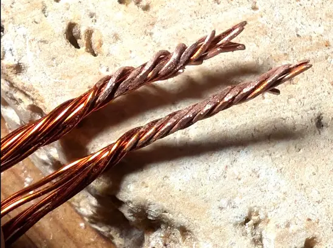

# KS184-125A, 1.8mm? (Cu? dark), 2 strands, 15 turns

- Power measurement:
    - V=73/28.5, I=29.7A, Ipp=18A
    - Ploss = -4.4784 std= 0.1549
      

Mod: added 2 turns (17 now):

- Power measurement
    - I=30.7A Ipp=16.7 (!)
    - Ploss= -3.7764 std= 0.2066

# KS184-125A, 1.8mm? (Cu?), 2 strands

- the coil design is not ideal
- core saturates early (u=125)
- has losses also during light load
- due to many turns, the magnetic field is even higher, core saturates

- Power measurement:
    - V=73/28.5, I=29.7A, Ipp=13A
    - Ploss = 10.6W +- 0.2W

# KS184-075A, 2.5mm CuW210, 2 strands, 17 turns

KS184-075A-CuW210-d2.5-s2-t17

- 2.5mm is AWG10.3
- had 3m of wire total (1.5m per strand)
- could not fit more than 17 turns
- excess 50cm
- core KS184-075A datasheet https://semic.cz/!old/files/pdf_www/Ljf_T184-S-075A_KD.pdf
- computed L0 = 48.8uH (core Al=169)
- micrometals analyzer:
    - ID ratio 0.35, which is completely off
    - 40khz, 30A: Ldc is 30-32, Ipp 12-14A, 4.8W Total loss, 2.76W copper loss
    - Rdc = 2.7mΩ, Rac factor = 7.731
- LCR meter measurement
    - DCR (4wire): 2.5mΩ
    - 1khz: 54uH, Rs=5.5mΩ
    - 10khz: 55uH, Rs=27mΩ
    - 100khz: 55uH, Rs=50mΩ
- consider using KS184-090A ?

- Power measurement:
    - V=73/28, I=30A, Ipp=14A
    - Ploss = Total Mean -5.8W std= 0.3 TODO propably wrong

# hf-litz

Core: KS185-075A
Coil: 32strands
Wire:
0.5mm wire (schneitech) AWG#24.1 or AWG#24.2
OD (with varnish): 0.545 mm .. 0.566 mm
Nennwiderstand bei 20°C: 0,0871 Ω/m (Gewicht - nur Kupferleiter ohne Lack - 8,96kg/dm³: 1,7593 kg/km)

Micrometals Analyzer:
L0 = 102.46
Ldc(30A) = 46.18 (45%)
Rdc = 0.006624
ID use ratio = 0.56
ploss(30A,27/45V,39khz) = 7.1 W (cu 6.105W)

Power Meausre:
Vin 72/28 I=29.4A, Ipp=8.08A
Vin 70/26.2 I=15.8 Ipp=4.73 => L = 89.5uH
Vin 69/26.9 I=23.2A Ipp=6.3A => L= 67.7uH
68.2/27 i=33.6 ipp=9.33 => L= 44.8uH
73.5/27.2 i=27.5 ipp=8A => L= ? TODO
i=33i=9.55

-> micrometals analyzer says 26 turns on their MS-184075-2 (same nom. Al=169nH)
inside a little paper box temperature rise is 35°C.

about 360cm total wire length pre-winding
excess after winding: 34+77
bonding wires: ?
total wound length: ?
forgot the count number of turns

termination
get a tool to remove the varnish
a good way seems to create bundles of 5

Rdc (4wire, keithley): 6.76mΩ
micrometals analyzer

TODO:

- measure Rdc
- measure L0
- use thermal imager to check strands

## 2s KS184-125A

- coil: w210 cu, 1.18mm, 12 strands (used 2m wire per strand)
- 10 turns?
- Measurement :
    - Vin 73.2/27.2, I=15.8A, Ipp=9.3A
    - 76/27 I=0, ipp=7
    - 73.5/27.3 I=34.3 Ipp=14.6A
    - 72.3/27.3 i=36.9 Ipp=15.6A

## 2s KS184-125A-d1.18-s10-n12

 

- coil: w210 cu, 1.18mm (schneitec), 10 strands (used 2m wire per strand)
- 12 turns?
- Rdc(keithley, 4wire clamps) = 2.43mΩ
- Measurements:
    - 73.3/27.3 I=30.4 Ipp=12.2A

TODO: 8 strands, 15 turns

# Codacoa

- in boost converter
- I=31A, Ipp = 14.8A
- Ploss = 4.9W std=0.33
  
- Power Measurements
    - 26/73V I=35.5A ipp=15A