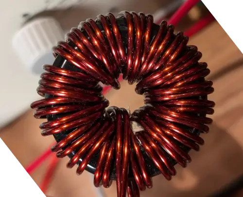

# Naming Convention
```


KS184µ075s1-CuDHP180s2T24
^ KS=core mat 
  ^ 184=core outer dia (1.84 inch)
      ^ µ075=initial permeability (75µ)
         ^ s1=1 core stacked         
```
```
CuDHP180s2T24
^ wire conductor material name
     ^ conductor diameter (1.8mm) (!= wire diameter !!!)
        ^ s2=2 strands
           ^T24=24 turns
```


# KS184µ125s1-1.8mm?, 2 strands, 15 turns

# *Too Many Turns* (KS184µ075s1-CuDHP180s2T24)
KS184125A
2s 1.8mm Cu-DHP (basteldrahtm evek) awg13
24 Turns



# wires
wire: https://www.ebay.de/itm/255497948294
```
Ø 1,80 mm Längenbeispiel: 100 g / ca. 4,3 m lang
Drahtdurchmesser / Nenndurchmesser: 1,80 mm
Gewicht - nur Kupferleiter ohne Lack - 8,96kg/dm³: 22,800 kg/km
Ø- Außen mit Lack Grad 2 (2L) Untere Grenzwert: 1,873 mm
Ø- Außen mit Lack Grad 2 (2L) Oberer Grenzwert: 1,909 mm
Nennwiderstand bei 20°C: 0,0067 Ω/m
```