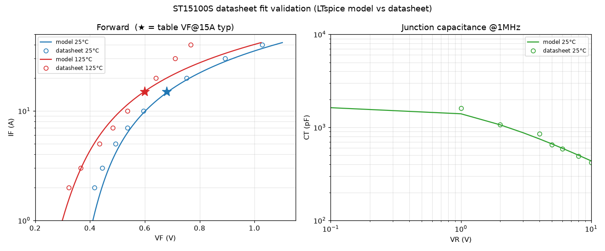

# ST15100S SPICE model — datasheet fit

SMC Diode Solutions **ST15100S** (100 V, 15 A trench-MOS Schottky rectifier,
TO-277B) has **no vendor SPICE model** published (the "Spice Model" column on
SMC's Ultra-Low-VF list points to the homepage). This directory builds one by
fitting the datasheet (N2219 Rev.-) and validating it in LTspice.

> **See also:** the lower-VF pin-compatible alternative **PANJIT SVT15100UB**
> (0.61 vs 0.68 V @15 A) — fit in [`../svt15100ub/`](../svt15100ub/README.md).
> Repo overview in [`../../README.md`](../../README.md).

**Model:** [`../../models/ST15100S.lib`](../../models/ST15100S.lib)

## Guiding principle: the datasheet outranks any vendor SPICE model

Trust order: **datasheet table > datasheet chart > vendor SPICE model.** A vendor
`.lib` is a *derivative* — a curve-fit constructed *from* the datasheet — so it can
only lose or distort information relative to the datasheet, never add it; the
temperature block (`TRS1/TRS2`, `EG`, `XTI`) is where it usually goes wrong. Case in
point: SMC's own **ST15100** model matches its datasheet at 25 °C but at 125 °C/15 A
gives 0.863 V vs the table's 0.66 V typ (+203 mV, wrong direction), exploding to
1.57 V @30 A — it contradicts the datasheet it ships with. So this model was built
*from the ST15100S datasheet*, and any vendor model should be validated against the
datasheet **at the operating point AND at temperature** before it's trusted.

## Result (LTspice-validated)

| Characteristic | Model | Datasheet | 
|---|---|---|
| VF @ 15 A, 25 °C | 0.685 V | 0.68 typ / 0.71 max |
| VF @ 15 A, 125 °C | 0.598 V | 0.60 typ / 0.64 max |
| CT @ 5 V, 1 MHz | 663 pF | 650 pF typ |
| CT @ 0 / 10 V | 2200 / 436 pF | 2200 / 420 pF |

## Method

1. **Data source.** SMC's site is behind a JS "browser security check" WAF
   (`_wtsjsk` cookie), so `curl`/WebFetch get 403. The datasheet PDF and the two
   sibling models (`ST15100`, `ST15100C`) were fetched with a headless browser
   (Playwright) that executes the challenge, then via same-origin `fetch`.
2. **Digitize the forward curves** (`trace_fwd.py`) — a gridline-calibrated
   raster trace of Figure 1 (both 25 °C and 125 °C), adapting the
   grid-mask + dark-run approach from `pwr-mosfet-lib/dslib/viz/raster_extract.py`,
   plus a connected-component filter to remove the in-chart label boxes. The
   guaranteed 15 A points come from the table, not the trace.
3. **Fit** (`fit` cells, see git history / notes) — IS, N, RS to the 25 °C
   operating region; CJO, VJ, MJ to the C-V curve; EG, XTI to the forward VF(T)
   shift. `EG = 0.69 eV` is the physical Schottky barrier and is independently
   consistent with the datasheet reverse-leakage temperature ratio (750×).
4. **Validate** (`val_fwd.cir`, `val_cap.cir`, `plot_validation.py`) in LTspice.

## Cross-check vs the manufacturer sibling model AND datasheet

Both SMC sibling **models** (`ST15100`, `ST15100C`) and the SMC **ST15100
datasheet** (N1038, `reference/ST15100_N1038_datasheet.pdf`) were pulled and
checked. Three findings, each of which validates a modelling choice here:

**(a) A single physical diode cannot reproduce the high-current tail of EITHER
sibling's Figure 1 — so anchor to the guaranteed table, not the chart tail.**
Both charts (digitized) show the 125 °C curve staying *lower-VF* than 25 °C at
every current — **no crossover** — with the gap narrowing to a mid-current
minimum then *widening* at high current:

| gap (VF₂₅ − VF₁₂₅) | 2 A | ~10 A (min) | 30 A |
|---|---|---|---|
| ST15100 (digitized) | +68 mV | +22 mV | +94 mV |
| ST15100S (digitized) | +94 mV | +60 mV | +182 mV |

Same shape; ST15100S just has a larger gap (bigger temp coefficient). A widening
high-current gap means the 125 °C incremental resistance is *lower* than 25 °C
(ST15100: 17.5→13.9 mΩ; ST15100S: 14.9→8.75 mΩ over 10→30 A) — hard to reconcile
with a Schottky's RS *rising* with temperature. A physical single-diode model
(positive RS-TC) instead makes the curves *converge* at high current, so it
cannot trace these chart tails. Hence the model is anchored to the guaranteed
**table VF@15 A** (both temps) + the 10–20 A operating region, and is allowed to
deviate from the extreme high-current 125 °C tail. This is inherent to fitting
either part — NOT an ST15100S-specific anomaly (an earlier version of this note
wrongly claimed ST15100's curves cross; they do not). See
`reference/ST15100_fig1_curves.png`.

**(b) SMC's own ST15100 model contradicts SMC's own ST15100 datasheet.** The
model gives VF@15A 0.666 V (25 °C) → **0.863 V (125 °C)** — but the datasheet
table says 0.70 → **0.66**. The model is +203 mV off and *backwards* in
temperature direction (its `EG=1.17` Si-bandgap + large `TRS1/TRS2`). Copying
that block would import the bug; this model uses `EG=0.69` so VF correctly falls.

**(c) The siblings have genuinely different temp coefficients** (ST15100 −40 mV,
ST15100S −80 mV @15 A over 25→125 °C), so a sibling model can't just be reused —
each part needs its own temperature fit.

(ST15100C datasheet: SMC's server 502s on that specific file; the direct TO-220
sibling ST15100 is conclusive.)

## Caveats

- Optimised for the 10–20 A operating region; the 2 A and 40 A tails carry more
  error (a single SPICE diode cannot fit the full 2–40 A span at both temps —
  the datasheet curves *diverge* with temperature).
- Reverse-leakage **magnitude** is ~20× low (0.5 µA vs 10 µA typ @100 V) — a
  known single-diode Schottky limitation (SMC's own sibling model under-predicts
  it too). The temperature *behaviour* is physical. Negligible for
  switching/conduction simulation.
- `TT=0`: Schottky, negligible reverse recovery.

## Files

| File | |
|---|---|
| `../../models/ST15100S.lib` | the model (validated) |
| `trace_fwd.py` | digitize Fig 1 forward curves |
| `datasheet_points.py` | digitized + table reference points |
| `val_fwd.cir`, `val_cap.cir` | LTspice validation benches |
| `plot_validation.py` | model-vs-datasheet overlay → `ST15100S_validation.png` |
| `reference/` | datasheet PDF, sibling mfr models, Fig-1 crops |

**LTspice-macOS gotcha:** run headless with `LTspice -b file.cir` (no `-Run`,
which hangs the GUI). Absolute `.include` paths do **not** resolve in `-b` mode —
use a relative path from the `.cir`, or inline the `.MODEL` (as `plot_validation.py` does).
