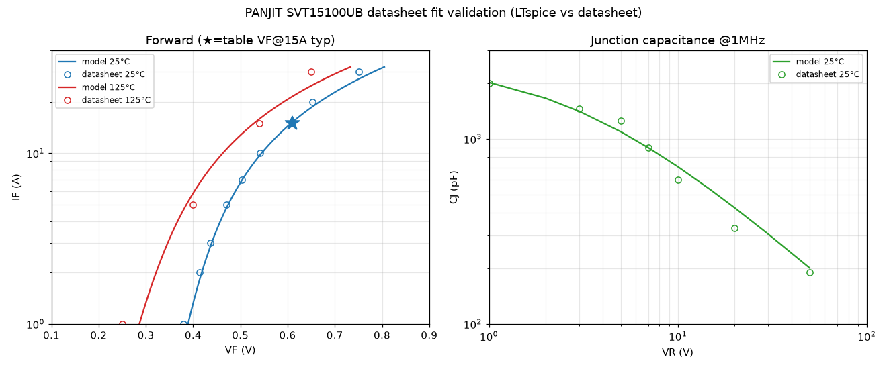

# PANJIT SVT15100UB SPICE model — datasheet fit

PANJIT **SVT15100UB** (100 V, 15 A "Extreme Low VF" trench-MOS Schottky, TO-277B)
has **no vendor SPICE model** — Panjit's library contains no SVT/trench parts at
all. Built from the datasheet (SVT15100UB-REV.02, 2025-12-10), same method as the
SMC `ST15100S` fit, and validated in LTspice.

**Model:** [`../../models/SVT15100UB.lib`](../../models/SVT15100UB.lib)

## Why this part

A lower-loss alternative to the SMC ST15100S (same 100 V/15 A/TO-277B):

| @15 A, 25 °C | **SVT15100UB** | SMC ST15100S |
|---|---|---|
| VF typ / max | **0.61 / 0.66 V** | 0.68 / 0.71 V |
| IR @100 V, 25 °C | **80 µA max** | 500 µA max |
| IFSM | 250 A | 220 A |
| Forward curves | **4 temps** (25/75/125/150 °C) | 2 temps |

## Result (LTspice-validated)

| Characteristic | Model | Datasheet |
|---|---|---|
| VF @15 A, 25 °C | 0.608 V | 0.61 typ / 0.66 max (table) |
| VF @5 A / 1 A, 25 °C | 0.474 / 0.389 V | 0.47 / 0.38 (table) |
| VF @15 A, 125 °C | 0.529 V | ~0.54 (Fig 4; not in table) |
| CJ @1 / 5 / 10 V | 2019 / 1091 / 707 pF | ~2000 / 1250 / 600 (Fig 2) |

## Method & fit notes

- Datasheet has only 6 pages, richer curves than SMC: **Fig 4 gives four forward
  temperature curves**. Digitized with a gridline-calibrated raster trace, the
  x-scale pinned to the vertical gridlines (`VF=(col-272)/858`) and the log-y
  calibrated against the 25 °C **table anchors** (1/5/15 A) — so the calibration
  is validated by the guaranteed points before any 125 °C value is read.
- Table gap: **no VF@15 A at 125 °C** (only 1 A & 5 A) — the 15 A/30 A hot points
  come from Fig 4 (~0.54 / 0.65 V). No tabular CT (Fig 2 only).
- `IS=9.5e-7, N=1.05, RS=0.0104` — lower RS than ST15100S (0.0144), matching the
  lower VF.
- **`TRS1=0`**: the datasheet's incremental resistance is ~14 mΩ at *both* 25 °C
  and 125 °C (5→15 A), so RS is temperature-independent here. This keeps the
  25/125 °C curves from crossing at high current (gap stays ~75 mV) — avoiding the
  vendor-model failure mode where an over-large RS tempco makes the hot curve
  explode past the cold one (see the SMC ST15100 model, `../reference/`).
- `EG=0.65` (~Schottky barrier) reproduces the VF(T) shift across all four curves
  and the ~1000× reverse-leakage temperature ratio (80 µA→15 mA @100 V).
- `TT=0`: Schottky. **Caveat:** reverse-leakage magnitude ~10× low (single-diode
  Schottky limit); the single-junction cap model can't perfectly track Fig 2's
  flat-then-knee shape (MJ=0.90 is the compromise). Both negligible for
  switching/conduction simulation.

Same guiding principle as the ST15100S fit: **the datasheet is the ground truth**
(here there's no vendor model at all), validate in LTspice at operating point and
temperature. Full write-up: [`../st15100s/README.md`](../st15100s/README.md);
index: [`../README.md`](../README.md).

## Files
| File | |
|---|---|
| `../../models/SVT15100UB.lib` | the model |
| `datasheet_points.py` | digitized + table reference points |
| `plot_validation.py` | model-vs-datasheet overlay → `SVT15100UB_validation.png` |
| `reference/` | datasheet PDF, Fig-4 (forward) & Fig-2 (cap) crops |
